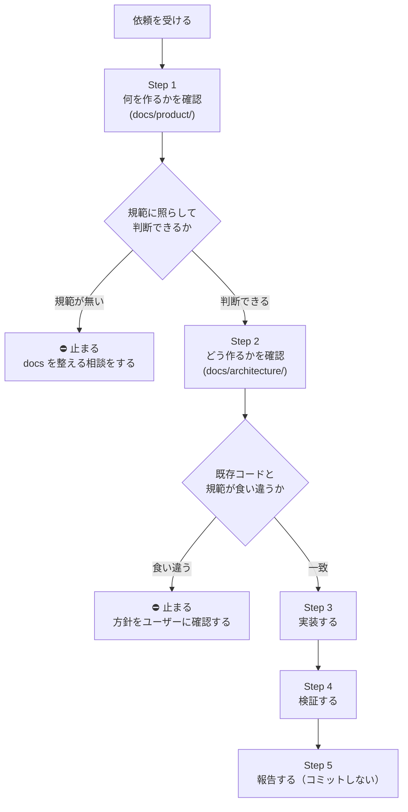

# フロントエンド UI 実装ハーネス

## このスキルの目的

**「設計ドキュメントを読まずに実装を始めてしまう」ことを防ぐ。**

このリポジトリでは設計規範が `docs/` に集約されていて、そこを読めば判断できるようになっている。
にもかかわらず実装から入ると、規範に反した構造を作り込んでから気づくことになる。
実際に起きた例として、画面 URL を設計したときに `docs/product/design-core.md`（すべての設計判断の最上位）を
参照しないまま進め、あとから作り直しになった。

このスキルは、その事故を**手順の形で防ぐ**。

| このスキルがやること                                    | やらないこと                           |
| ------------------------------------------------------- | -------------------------------------- |
| どの順で作業するかを決める                              | 設計規範そのものを定める               |
| 各段階で「どの docs を開くか」を指す                    | docs の内容をここに書き写す            |
| 止まってユーザーに確認すべき地点を明示する              | 規範の無い判断を勝手に決める           |
| docs に書けない運用知（ツール都合・ハマりどころ）を持つ | コードから読めることを重複して説明する |

> **このファイルは規範ではない。** 規範は `docs/` にある。ここに規範を書き写すと二重管理になり、必ず片方が腐る。

## 使うタイミング

`apps/beatfolio` / `packages/ui` に**画面・フォーム・コンポーネントを追加/変更するとき**。
既存コンポーネントの軽微な文言修正やスタイル調整だけなら、Step 2 以降だけでよい。

## 入出力契約

### 入力（これが無いと始められない）

| 入力                 | 必須 | 無い場合                                                    |
| -------------------- | ---- | ----------------------------------------------------------- |
| 作るものの概要       | ○    | ユーザーに聞く                                              |
| 対象範囲             | ○    | `apps/beatfolio` か `packages/ui` かを確認する              |
| 動線・情報設計       | ○    | `docs/product/` で確定させる。無ければ ⛔ 止まって相談する  |
| 参照すべき既存の実装 | −    | 類似コンポーネントを自分で探す（`packages/ui` 配下を grep） |

### 出力（完了時に必ず返す）

| 出力               | 内容                                                   |
| ------------------ | ------------------------------------------------------ |
| 変更ファイル一覧   | 追加 / 変更 / 削除を区別して                           |
| 適用した規範と根拠 | 「この判断は `docs/…` のこの規範による」の対応         |
| 自分で決めた判断   | **規範に無くて暫定で決めたこと**。レビューの焦点になる |
| 検証結果           | tsc / test / build の**事実**。落ちたなら出力とともに  |
| 未解決の確認事項   | 判断を保留した点                                       |
| コミットの有無     | 原則コミットしない。していないことを明示する           |

### 出力（⛔ で中断したとき）

実装を進めず、次を返して判断を仰ぐ。

- **何と何が食い違ったか**（規範のパス / 既存コードの箇所）
- **選択肢**（規範に合わせる / 規範を変える / 例外にする）とそれぞれの影響範囲
- **推奨**とその理由

## 実装フロー



**⛔ の2箇所で必ず止まる。** 勝手に既存へ合わせない・勝手に決めない（CLAUDE.md）。

---

## Step 1. 何を作るかを確認する

`docs/README.md`（索引）で全体像を掴んでから、`docs/product/` を順に読む。

| 読む                                         | ここで確定させること                     |
| -------------------------------------------- | ---------------------------------------- |
| `docs/product/design-core.md`                | この機能がプロダクトのどの課題に効くのか |
| `docs/product/flow-design.md`                | ユーザーがどこから来て、どこへ抜けるか   |
| `docs/product/profile-information-design.md` | 何を・どの順で・どこまで開示するか       |

**動線と情報設計が決まる前に部品を作り始めない**（[[feedback_business_design_before_ai]]）。
必要なら素の HTML で動線を確認してから React 化する。

> **規範は `docs/product/` と `docs/architecture/` のみ。**
> `docs/plans/`（時限的な計画）と `docs/discussions/`（未合意の検討）は判断の根拠にしない。

**⛔ 止まる条件**: 規範が存在しない設計判断が必要になったとき。
コードに落とす前に、**docs 側を整える方向で相談する**（CLAUDE.md）。

## Step 2. どう作るかを確認する

作るものが決まったら、**着手する部分の規範だけ**をその都度開く。全部先読みしなくてよい。

| これから作るもの                | 開く規範                                                                                                                    |
| ------------------------------- | --------------------------------------------------------------------------------------------------------------------------- |
| 画面を足す / URL を決める       | `docs/architecture/frontend/routing.md`                                                                                     |
| データ取得・更新の経路          | `docs/architecture/frontend/bff/design.md`                                                                                  |
| 表示語彙（ラベル・選択肢）      | `docs/architecture/frontend/bff/design.md`（BFF で解決）+ `docs/architecture/server/database/design.md`（出所は DB マスタ） |
| atom / molecule / organism 分割 | `docs/architecture/frontend/ui/component-design.md`                                                                         |
| `"use client"` の境界           | `docs/architecture/frontend/ui/component-design.md`                                                                         |
| フォーム（RHF + zod）           | `docs/architecture/frontend/ui/form-design.md`                                                                              |
| primitive の追加                | `docs/architecture/frontend/ui/ui-library.md`                                                                               |
| 色・スタイル                    | `docs/architecture/frontend/ui/tailwind.md`                                                                                 |
| レスポンシブ                    | `docs/architecture/frontend/ui/responsive.md`                                                                               |
| Storybook                       | `docs/architecture/frontend/ui/storybook.md`                                                                                |
| 状態を持たせる判断              | `docs/architecture/frontend/state-management.md`                                                                            |

横断のレビュー観点は `.claude/rules/code-review-checklist.md`。

**⛔ 止まる条件**: 既存コードが規範と食い違っているとき。
**設計ドキュメントが規範、既存コードは実装結果**。既存に合わせず、ズレを共有して方針を確認する（CLAUDE.md）。

## Step 3. 実装する

Atomic Design の順＝**部品から外側へ**。

```
不足 primitive を shadcn add
  → atoms → molecules → organisms
  → BFF route（read/write）
  → app（page.tsx = server / ClientAdapter / hook）
  → Storybook（描画する atom/molecule/organism 全部）
```

各段階で Step 2 の対応表から該当ドキュメントを開く。記憶で書かない。

## Step 4. 検証する

```bash
cd packages/ui && npx tsc --noEmit          # 型
cd apps/beatfolio && npx tsc --noEmit       # アプリ側を変更したなら
cd apps/beatfolio && npx vitest run         # テスト
cd apps/beatfolio && npx next build         # ルート構成の検証（page を足したとき）
cd packages/ui && npm run storybook         # 目視（:6006）
```

- 描画する atom/molecule/organism すべてに `index.stories.tsx` があるか。
- **`Agent` を1本立てて diff を敵対的にレビューさせる。** 自分の実装を自分で見ると、意図が見えているぶん盲点が残る。

## Step 5. 報告する

- **コミットはユーザーに明示的に言われるまでしない。**
- 変更ファイル一覧と、**自分で判断した箇所**（規範に無くて暫定で決めたこと）を明示する。
- 検証結果は事実のまま報告する。落ちたテストがあれば出力とともに伝える。

---

## docs に書けない運用知

ツール都合・ライブラリ都合で、設計ドキュメントには載らないもの。

- **worktree で作業するなら `npm install` をその場で実行する。** monorepo の依存は worktree に hoist されない。
- **`npx shadcn@latest add` は `packages/ui` で実行する**（`components.json` がそこにある）。ネットワークが要る。生成物は改変せず `primitives/index.ts` に export を足す。
- **`Image` atom は `react-lazy-load-image-component`（クラスコンポーネント）依存で、RSC から直接描画するとビルドが落ちる。** `Super expression must either be null or a function` が出たらこれ。app 側に ClientAdapter を1枚挟む。
- **`Typography` は `className` を受け付けない。** 構造スタイルを足したくなったら、それは呼び出し側で包むか `variant` / `tone` 軸を増やす合図。
- **`next build` はルート衝突や RSC 境界の破綻を検出する。** `tsc` とテストが通っても build で落ちることがある。
- **ルートを消したらリンク参照を掃除する。** `grep -rn 'href="/削除したパス"'`。残すと 404 になる。
- **root の eslint 設定が `eslint-plugin-storybook` を要求する。** 未インストールの環境では lint が動かない（コード起因ではない）。

## やりがちな失敗

- 情報設計が決まる前に部品を作り始める（動線 → 項目 → 部品の順）。
- 規範を読まずに既存コードを真似する（既存が規範とズレている可能性がある）。
- モックのアドホックカラーをそのまま実装に持ち込む。
- 一部のコンポーネントだけ story を書いて満足する。
- 言われていないのにコミットする。
