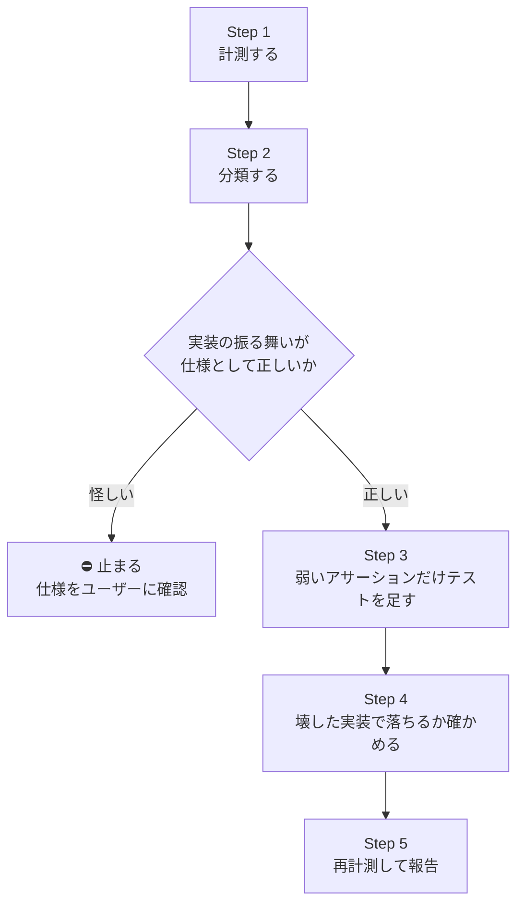

# テスト検知力の強化ハーネス

## このスキルの目的

**「数字を上げるためのテスト」と「検知したつもりのテスト」を防ぐ。**

mutation score や test-audit の指標は、読み方を間違えると逆効果になる。

- survived mutant を全部潰そうとすると、等価変異（どの入力でも区別できない）や計測上の偽 survived に対して意味のないテストが増える（`strategy.md` §6・§12-5）
- 足したテストや lint ルール・計測器の判定が、**壊した実装に対して本当に落ちるか**を確かめないと、検知の仕組みそのものが偽パスする

このスキルは、その 2 つを**手順の形で防ぐ**。

| このスキルがやること                                       | やらないこと                                |
| ---------------------------------------------------------- | ------------------------------------------- |
| survived / 指摘を分類し、テストを足すべきものだけを選ぶ    | テストの書き方の規範を定める（docs にある） |
| 足したテスト・ルールが「壊した実装で落ちる」ことを確かめる | 閾値を決めて CI を落とす                    |
| 計測ツールのハマりどころ（static mutant 等）を持つ         | 統合テスト基盤を作る（#341 の範囲）         |

> **このファイルは規範ではない。** 規範は `docs/architecture/testing/strategy.md` / `background.md`、計測器の読み方は `scripts/test-audit/README.md` にある。

## 使うタイミング

- nightly の mutation workflow（`.github/workflows/mutation.yml`）のレポートに survived がある
- `npm run test:audit` に指摘が出ている（A〜E、Repository のビルダ呼び出し検証、テストのないモジュール）
- `scripts/test-audit/index.mjs` や `eslint.rules.mjs` の `local-test/*` を直す・足す
- 本番に漏れたデグレを `scripts/test-audit/README.md` §3 の分類で記録し、「偽パス（構造）」だった

機能実装に伴うテストは `api-server-feature` / `frontend-feature` の Step 4 で扱う。このスキルは**既存テストの強化**に使う。

## 入出力契約

### 入力

| 入力                   | 必須 | 無い場合                                                                         |
| ---------------------- | ---- | -------------------------------------------------------------------------------- |
| 対象（層・モジュール） | ○    | ユーザーに聞く。無指定なら domain から（検知力の原本で、score の意味が一番強い） |
| 計測結果               | −    | 自分で取る（Step 1）                                                             |

### 出力

| 出力                     | 内容                                                                                   |
| ------------------------ | -------------------------------------------------------------------------------------- |
| 計測値の前後             | mutation score（層別）・survived 件数・test-audit の指標。**同じコマンドで取った事実** |
| 分類表                   | survived / 指摘ごとに「弱いアサーション / 等価変異 / 偽 survived / 仕様外」と根拠      |
| 足したテストと殺した変異 | どのテストがどの survived を殺したか                                                   |
| 検知の確認結果           | 足したテスト・ルールを、壊した実装に当てて落ちた件数                                   |
| 見つかった仕様の穴       | テストを足す過程で「実装がそもそも仕様どおりか怪しい」と分かったもの（⛔ 参照）        |
| Issue にすべきもの       | 統合テストが要るもの・範囲外のもの                                                     |

## フロー



## Step 1. 計測する

```bash
npm run test:audit                                          # 構造の指標
cd apps/api-server && npm run test:mutation:domain          # 層を絞る（全量は nightly に任せる）
cd apps/api-server && npm run test:mutation:incremental     # 変更分だけ
```

survived の一覧は JSON レポートから行番号つきで出す（HTML を目で追わない）:

```bash
cd apps/api-server && node -e '
const r=require("./reports/mutation/report.json");
for (const [f,v] of Object.entries(r.files)) { const L=v.source.split("\n");
  for (const m of v.mutants) if (m.status==="Survived")
    console.log(f.replace(/.*src\//,"")+":"+m.location.start.line, m.mutatorName, "|", L[m.location.start.line-1].trim()) }'
```

## Step 2. 分類する

survived は必ず 1 件ずつ次のどれかに入れ、**根拠を一行で書く**。

| 分類                        | 判定                                                                                                       | 対応                                 |
| --------------------------- | ---------------------------------------------------------------------------------------------------------- | ------------------------------------ |
| 弱いアサーション            | 変異後の振る舞いを区別する入力が存在し、それが仕様上意味を持つ                                             | Step 3 でテストを足す                |
| 等価変異                    | どの入力でも実装と区別できない（他の条件が同じ入力を先に弾く等）。区別できる入力を探して無いことを確かめる | 足さない。報告に根拠を残す           |
| static mutant の偽 survived | モジュール読み込み時に評価される式（モジュール定数・`new Map(CODES.map(...))` 等）への変異                 | 手で確かめる（下記）                 |
| 仕様外 / 到達不能           | その分岐は仕様に無い、または到達しない                                                                     | 足さない。到達不能なら実装を消す提案 |

**static mutant は手で確かめる。** vitest runner はモジュールを読み直さないため、落ちるはずでも survived と出ることがある。該当行に同じ変異を手で入れて `npx vitest run <対象>` し、落ちれば偽 survived。確認後は必ず元に戻す。

usecase / route の score は合成の責務だけ見ているので低くて正常（`scripts/test-audit/README.md`「2. 検知力」）。層をまたいで一つの数字にしない。

test-audit の指摘も同じように分類する。C（手書きフィクスチャ）・D（責務漏れ）は**疑いまで**の指標なので、実物を読んで判断する。E（殻の契約カバー）と Repository のビルダ呼び出し検証は統合テストの範囲（#341 / #342）で、ここでは直さない。

**⛔ 止まる条件**: 区別する入力を考えた結果、**実装の振る舞い自体が仕様として正しいか怪しい**とき（例: その入力を受け付けるべきか弾くべきか、docs から判断できない）。テストで現状の振る舞いを固定する前にユーザーに確認する。テストは実行可能な仕様（`strategy.md` §1）なので、怪しい振る舞いを固定すると誤りが仕様になる。

## Step 3. 弱いアサーションだけテストを足す

- 足すテストは**振る舞いの名前**で書く（「〜は err を返す」）。変異の名前（「ConditionalExpression を殺す」）で書かない
- 既存の `it.each` の表に行を足せるなら足す。1 変異 1 テストに分けない
- 観測点を選ぶ: 公開関数の戻り値を `toStrictEqual` で見る。途中で情報を落とす関数（`toView` 等）経由では変異が見えないことがある
- 規範は `strategy.md`（§4 レイヤー責務・§8 エラー・§9 時間と乱数・§12 アンチパターン）。書き方をここで決めない

## Step 4. 壊した実装で落ちるか確かめる

**足したテスト・ルール・計測器の判定は、壊した実装に当てて落ちることを確かめてから完了にする。** 緑を見ただけでは「検知できる」ことは分からない。

| 足したもの                        | 壊し方                                                                                           |
| --------------------------------- | ------------------------------------------------------------------------------------------------ |
| domain / usecase のテスト         | 再計測で該当 mutant が killed になるか。static なら手で変異を入れる                              |
| lint ルール（`eslint.rules.mjs`） | ルールを `off` にしてルールのテスト（`eslint.rules.test.mts`）が落ちるか                         |
| test-audit の判定                 | `git show HEAD:scripts/test-audit/index.mjs` の旧版に `npm run test:audit:test` を当てて落ちるか |

計測器（test-audit / lint ルール）を直したら、**すり抜けた形を `scripts/test-audit/index.test.mjs` / `eslint.rules.test.mts` にケースとして足す**。検出と非検出（誤検知しない形）の両方を置く。

## Step 5. 再計測して報告する

- Step 1 と同じコマンドで再計測し、前後を並べる
- 残った survived はすべて Step 2 の分類と根拠つきで列挙する（「残りは等価変異」とまとめて済ませない）
- `thresholds.break` は `null` のまま。score を CI の合格ラインにしない（§6）
- コミットはユーザーに言われるまでしない

---

## docs に書けない運用知

- **Stryker の実行中は `.stryker-tmp/sandbox-*` にリポジトリの写しができる。** その間に `vitest run` / `tsc` / `knip` を回すと写しのテスト・型まで拾い、無関係な失敗が出る。実行中の結果は `.stryker-tmp` を除いて読むか、終わってから回す
- **Stryker の実行中に `git stash` / ブランチ切り替えをしない。** sandbox は開始時に写すので計測自体は壊れないが、手元の状態と計測対象がずれる
- **`--mutate` は設定ファイルの `mutate` 配列を除外パターンごと置き換える。** 層を絞るときは `!src/**/*.test.ts` 等の除外も一緒に渡す（`test:mutation:domain` を参照）
- **domain の全量は数分〜十数分かかる。** mutant の 6 割が static で全テストの再実行になるため。`ignoreStatic` は static を計測から外すだけなので使わない
- **incremental は `.stryker-tmp/incremental.json` を前回の結果として使う。** 初回や、このファイルが無い環境では全量と同じ時間がかかる
- **vitest は型を見ない。** テストに足したフィクスチャの型誤り（`as const` による readonly 化等）は `tsc --noEmit` でしか出ない。`next build` はテストファイルも型検査するので、CI では build で落ちる

## やりがちな失敗

- survived を全部潰しにいく（等価変異・偽 survived に意味のないテストを書く）
- static mutant の survived を、手で確かめずに「弱いアサーション」と判断する
- 足したテストが緑になったことだけ見て、壊した実装で落ちるかを確かめない
- 現状の振る舞いが仕様として怪しいのに、テストで固定する（⛔ で止まる）
- 計測器を直したのに、すり抜けた形をテストケースとして残さない
- score を上げること自体を目的にする（`strategy.md` §6）
