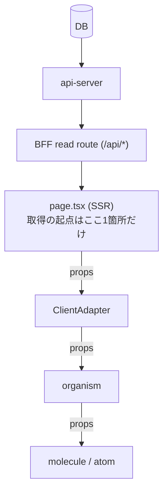
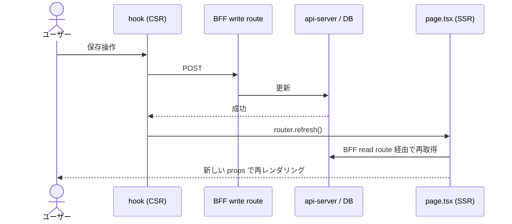
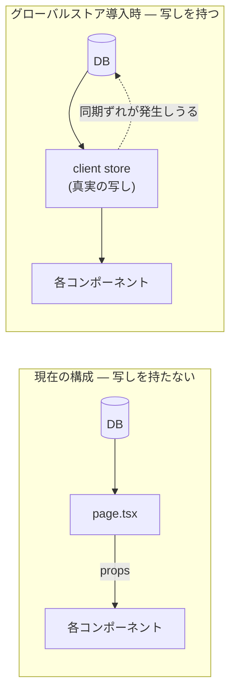
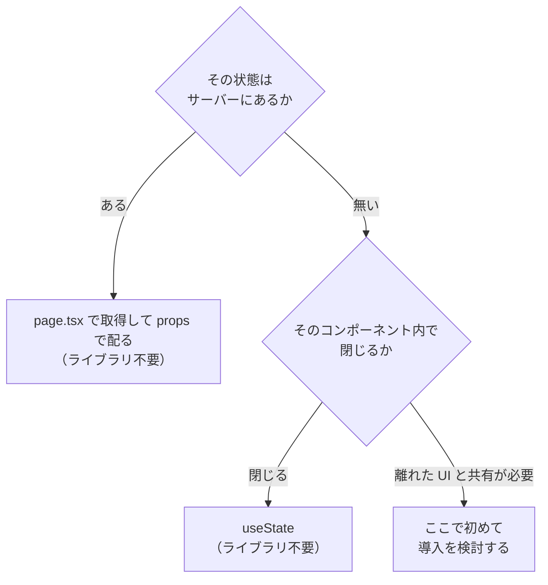

# 状態管理

> **位置づけ**
> グローバル状態管理ライブラリを**導入しない**という決定と、その理由・再検討の条件を記録する。
> `"use client"` の境界や `packages/ui` の Next 非依存については [`ui/component-design.md`](./ui/component-design.md)、
> サーバーからのデータ取得経路については [`bff/design.md`](./bff/design.md) を参照。

---

## 決定

グローバル状態管理ライブラリ（Jotai 等）は**導入しない**。

- `packages/ui` には入れない。props in / callback out を維持する
- `apps/` 側も `useState` + props で足りる

## なぜ不要か

「今は足りているから」ではなく、**現在の構成では共有すべきクライアント状態が構造的に生まれない**ため。

### 1. 参照するデータは ID に紐づく一意の情報の最新値であり、真実の出所は DB にある

画面が必要とするのはユーザー・アーティスト・プロフィールといった **ID で一意に定まるリソースの最新状態**であって、クライアントが独自に育てる状態ではない。真実の出所は常に DB 側にある。

### 2. 取得は page.tsx が最上位で1回だけ行い、子へは props で配る

取得の起点が最上位に1つしかないため、離れたコンポーネント同士が同じデータを別々に取りに行くことがない。**共有の必要が発生しない**。

### 3. 更新後は再取得ではなく再レンダリングで最新化する

更新（write）はクライアントの hook から BFF write route を叩き、成功後に `router.refresh()` を呼ぶ。これで page.tsx が再実行され、**新しい props が上から降りてくる**。

クライアントにデータの写しを持たないので、**キャッシュの同期ずれが原理的に起きない**。ライブラリが解決する問題（複数箇所に散ったコピーの整合性）自体が発生しない。

この差を並べるとこうなる。

### 4. クライアント状態はコンポーネント内で閉じる一時的なものだけ

入力途中の値・モーダルの開閉・ウィザードのステップなど、**そのコンポーネントの外に出す必要がないもの**しかない。これらは `useState` の適用範囲そのもの。

> **「認証 / ユーザー情報をアプリ全体で参照したい」は導入理由にならない。**
> それらも ID に紐づくサーバー状態であり、page.tsx が取得して props で配れば足りる。参照箇所が増えても構造は変わらない。

## 再検討の条件

上記の前提が崩れる、つまり **SSR の props では表現できないクライアント固有の共有状態**が生まれたときに見直す。

具体的には次のような場合。

- 離れた複数の UI が、**保存前の編集中データ**を同時に参照する必要が出た（サーバーに無いので props で配れない）
- WebSocket 等のサーバープッシュを受け、クライアント側で状態を保持する必要が出た
- 楽観更新やオフライン対応のため、クライアントに真実の写しを置く必要が出た
- FSD 等でアプリケーションレイヤーごとに UI を持つ構成に変わり、最上位から props を配れなくなった

props drilling が深くなった場合は、**まず構成（コンポーネント分割・データの降ろし方）を見直す**。ライブラリ導入は構成の問題を隠すだけで解決しない。
