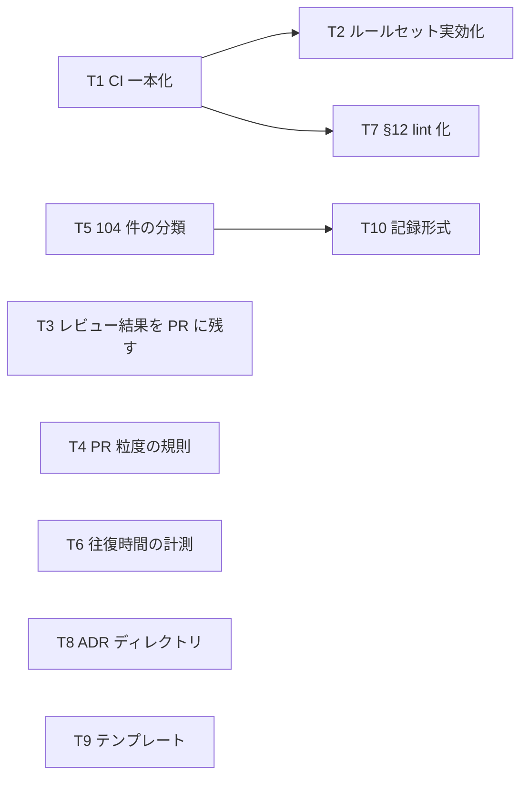

# 自律実装の前提として、まずやるべき課題

> **ステータス: 未合意（提案）**
> [autonomous-implementation-structure.md](./autonomous-implementation-structure.md) の議論と、直近 1 か月の PR 計測から抽出した着手候補。合意した課題は Issue 化する。
> 計測日: 2026-09-20 / 対象: 2026-08-22〜09-20 にマージされた PR 29 件（Dependabot を除く）

## 前提となる判断

- 当初の動機は「自動化して負荷を下げたい」だったが、計測すると **負荷は CI とマージ工程には無い**。CI の失敗は月 5 回、マージまでの中央値は 5.2 時間、半数の PR はレビュー無しで即マージされている
- 負荷は **大きい PR に集中**している。CodeRabbit の指摘 104 件の半分が 3 つの PR に集まり、100 時間超かかった 3 件はすべて 74〜108 ファイルの機能 PR
- 負荷より先に **信頼の穴**が出た。29 件中 13 件にレビューの記録が一切なく、そこに 100 ファイル前後のリファクタが 3 本含まれる。main のルールセットに required status checks が無く、承認要件は管理者バイパスで形骸化している
- したがって **自動化そのものは後回し**にし、「自動化しなくても価値があるもの」だけを先にやる

### 計測値

| 指標                                        | 値                                                                                    |
| ------------------------------------------- | ------------------------------------------------------------------------------------- |
| PR サイズ（変更ファイル数）                 | 中央値 17、最大 128、50 以上が 8 件                                                   |
| 作成からマージまで                          | 中央値 5.2 時間。24 時間超 6 件、100 時間超 3 件（#313 / #314 / #315）                |
| CI 実行                                     | 230 回、失敗 5 回（2%）                                                               |
| レビューが一切ない PR                       | 13 件 / 29 件。うち 40 ファイル以上が #245（128）、#298（99）、#308（97）、#290（42） |
| CodeRabbit の指摘                           | 104 件。上位 3 PR（#300 / #246 / #287）で 52 件                                       |
| 指摘への人の返信 / レビュー後の修正コミット | 37 件 / 27 件                                                                         |

未計測: ユーザー自身が diff を読み、ローカルで Claude と往復している時間。負荷の大半がここにある可能性が高い（T6 で測る）。

## 課題の抽出基準

次の 3 つをすべて満たすものを「まずやる」に入れた。

1. 自動化しなくても価値がある（判断基準・記録・信頼のどれかに効く）
2. 計測か現状確認で裏付けがある
3. 新しい設計を要しない、または設計が 1 枚以内で済む

自動化そのもの（auto-merge、Action 化、判定ジョブ）は基準 1 を満たさないため保留に置いた。

---

## まずやる課題

### 優先 1: 信頼の穴を塞ぐ（設定変更が中心）

#### T1. CI の穴を埋め、`ci.yml` に一本化する

- **何を**: ルートで `turbo run lint test check-types build` を全 workspace に対して走らせる `ci.yml` を作り、`api-server.yml` / `beatfolio.yml` と `deploy-preview.yml` 内のテスト重複を解消する。Chromatic の paths を `packages/ui/**` に直す（使わないなら削除）。`.nvmrc` と `engines` を置き、全ワークフローが `node-version-file` で読む
- **なぜ**: `packages/database` と `packages/ui` の vitest が CI で走っていない（`--filter=api-server` は依存を含まない）。beatfolio は lint と build のみ。Chromatic は存在しないパスを見ていて一度も起動していない。Node が 20 / 22.12.0 / `env.NODE_VERSION` で不揃い
- **完了条件**: 全 workspace の `test` が PR の CI で実行され、ジョブ名が固定される（T2 が参照するため）。同じテストが 1 PR で 2 回走らない
- **設計**: 不要
- **依存**: なし。T2 の前提

#### T2. main のルールセットを実効化する

- **何を**: required status checks に T1 のジョブを登録する。conversation resolution（未解決スレッドがあればマージ不可）を有効にする。管理者バイパスを外す。単独開発で自己承認できない「承認 1 件必須」は外し、契約ファイル（schema / API zod / props 型）に触れる PR のみ承認必須にする（CODEOWNERS か後続の判定で）
- **なぜ**: 現在は CI が赤でもマージでき、承認要件は毎回バイパスで越えている。13 件のレビュー無しマージはこの構造の結果
- **完了条件**: CI が赤の PR、未解決スレッドのある PR がマージできない。`gh api .../rulesets/8830922` に `required_status_checks` が含まれる
- **設計**: 不要
- **依存**: T1

#### T3. ローカルレビューの結果を PR に残す

- **何を**: code-review skill の出力（🔴 / 🟡 / ⚪ ごとの所見と、対応した・却下した の判断）を PR コメントとして投稿する手順を、PR 作成手順（beta-ticket Step 4 相当）に組み込む
- **なぜ**: 29 件中 13 件はレビューの記録が無い。ローカルで Claude のレビューを通していても PR 上に残らず、後から「何を見て通したか」を辿れない。自動化ではなく記録の問題
- **完了条件**: 新規 PR に必ずレビュー結果のコメントが 1 件付く。既存の `token-report` と同じ形（マーカー付きコメントの upsert）
- **設計**: 出力の形式のみ（項目 ID・判定・根拠 `file:line`）。§3 の出力契約の先行実装になる
- **依存**: なし

### 優先 2: 負荷の正体（PR 粒度と繰り返し）に効く

#### T4. PR 粒度の規則を task-breakdown に足す

- **何を**: Step 4（タスク分解）に PR の上限を置く。候補は「変更ファイル 40 以下」または「契約 1 単位（1 つの API 応答 / 1 画面の props）につき 1 PR」。超える場合は Issue の段階で PR① / PR② に割る（#274 / #275 で既に行っている分割を規則化する）
- **なぜ**: 50 ファイル以上の PR が 8 件。CodeRabbit の指摘は 79 ファイルの #300 に 22 件集中し、100 時間超の 3 件はすべて 74〜108 ファイル。レビュー負荷と滞留の両方が粒度に起因している
- **完了条件**: task-breakdown SKILL.md に上限と分割規則が書かれ、以降の Issue が PR 分割欄を持つ
- **設計**: 上限値の決定のみ
- **依存**: なし

#### T5. CodeRabbit の指摘 104 件を分類する（フィードバック蓄積の予備調査）

- **何を**: 上位 3 PR（#300: 22 件、#246: 19 件、#287: 11 件）の 52 件を「lint 化できる / 規範の修正が要る / 一過性」に分類し、繰り返し現れる指摘があるかを見る
- **なぜ**: 「同じ指摘を何度も受けている」かどうかが未確認。仕組み（記録形式・収集スクリプト）を作る前に、材料が既にある 104 件で仮説を検証する。1 時間で終わる
- **完了条件**: 52 件の分類表と、繰り返し指摘の一覧。lint 化候補があれば T7 と同じ形で Issue にする
- **設計**: 不要
- **依存**: なし。T10 の入力

#### T6. ユーザー自身の往復時間を測る

- **何を**: `token-report` skill で直近 1 か月のブランチ別トークン使用量（指示別・フェーズ別）を集計し、PR サイズ・レビュー件数と並べる
- **なぜ**: 今回の計測は GitHub 上の痕跡だけで、ローカルで diff を読み Claude と往復している時間が入っていない。負荷の大半がここにある可能性が高く、ここを測らないと「負荷を下げる」の対象が定まらない
- **完了条件**: PR ごとの「ローカル往復量 / PR サイズ / レビュー件数」の表。負荷がどの工程（実装前の設計 / 実装 / レビュー対応）に寄っているかが読める
- **設計**: 不要
- **依存**: なし

### 優先 3: 判断基準に形を与える（小さな規範変更）

#### T7. チェックリスト §12（Optional フォールバック）を lint に降ろす

- **何を**: `?.` 直後の `?? ""` / `?? 0` / `?? []` / `?? false` を `no-restricted-syntax` で error にする。既存違反は棚卸しして直すか、行単位で理由付き disable にする
- **なぜ**: 🔴 5 項目のうち唯一、判定が完全に決定的。LLM や人に見せている観点を最も左の手段に移す最初の実例
- **完了条件**: ルールが error で有効、`eslint.rules.test.mts` に落ちる例と通る例がある、CI で走る
- **設計**: 不要
- **依存**: T1（CI で走らせるため）

#### T8. 設計判断の記録先 `docs/adr/`（ADR）を新設する — #319 で実施

- **何を**: `docs/adr/` を新設し、README に形式（背景 / 決定 / 理由 / 却下した案 / 結果 / 影響する規範 + ステータス・出所）と運用（`plans/` / Issue には決定の本文を書かずリンクだけ置く）を書く。`docs/README.md` の 4 分割表に 5 行目を足す。PR #319 §5 の 6 件を最初の ADR として切り、§5 はリンクに置き換える。skill の「止まるべき地点」で停止したときは、この形式の下書きを `adr/` に「提案」ステータスで出す（最初の実例: 0007、#330）
- **なぜ**: ライフサイクルで欠落している段階 2。決定が `plans/`（時限）と Issue に散り、完了後に理由が辿れない
- **完了条件**: ディレクトリと README があり、#319 の 6 件が記録されている
- **設計**: 形式の 6 節のみ
- **依存**: なし

#### T9. PR / Issue テンプレートを `.github/` に置く

- **何を**: `.github/pull_request_template.md`（受け入れ条件トレース: 条件 → テストパス / QA ID / 未担保理由、変更クラスの自己申告、自分で決めた判断、検証結果）と `.github/ISSUE_TEMPLATE/`（task-breakdown Step 4 の型をそのまま）
- **なぜ**: #314 の PR 本文は既にこの形をしているが、skill 内の暗黙知で、人が手で PR を書くと崩れる。形を与えることで後続の機械検査（トレースの充足）が可能になる
- **完了条件**: テンプレートが存在し、beta-ticket / 実装 skill がそれを埋める
- **設計**: トレース欄の形式のみ
- **依存**: なし

#### T10. フィードバック記録の形式を決める

- **何を**: 1 件あたり「出所 / PR・ファイル・行 / 要約 / 対応と理由 / 分類 / 規範参照」の形式と置き場（`docs/discussions/` 配下か `.claude/` 配下）を決める。マージ時に PR のスレッドを取り込むスクリプトは、今回の計測スクリプトを土台にできる
- **なぜ**: 観点はループが生む。先に決めるのは記録の形式だけ
- **完了条件**: 形式が決まり、T5 の 52 件がその形式で入っている
- **設計**: 形式のみ
- **依存**: T5

---

## 保留（自動化そのもの、または前提が揃うまで待つ）

| 項目                                                     | 保留の理由                                                              | 再開条件                                             |
| -------------------------------------------------------- | ----------------------------------------------------------------------- | ---------------------------------------------------- |
| auto-merge（`allow_auto_merge`、`gh pr merge --auto`）   | マージ工程に負荷が無い。T2 が無い状態で入れると赤のまま自動マージされる | T1〜T3 完了後                                        |
| Skill レビューの status check 化（`claude-code-action`） | 出力契約と golden set が先。T3 の記録で形を固めてから                   | T3 の形式が 10 PR 程度安定してから                   |
| 変更クラス判定ジョブ                                     | 分類自体は T9 の自己申告で始める。ジョブ化は PR 数が増えてから          | T9 完了後                                            |
| 修正ループの Action 化                                   | CI 失敗が月 5 回。直す手間が無い                                        | CI 失敗率が上がったとき                              |
| Preview DB 単一の解消                                    | 現在は並行 PR が少なく顕在化していない                                  | schema 変更 PR が同時に 2 本以上並ぶようになったとき |
| 規範への ID 付与、enforcement-inventory                  | T7 / T8 / T10 で「規範を指す」必要が出てから、必要な節だけ振る          | T8 か T10 が規範を参照し始めたとき                   |
| 軸 C（PRD と実装の定期照合）                             | B が数回転してから                                                      | T10 の記録が 2 周期分たまってから                    |

---

## 依存関係と着手順

- 並行して始められるのは T1 / T3 / T4 / T5 / T6 / T8 / T9
- T6 の結果で優先 2 以降の順序を見直す。負荷が「実装前の設計」に寄っていれば T4 より task-breakdown 側の整備が先になる
- 各課題は完了条件が観察可能な述語になっているので、そのまま Issue の「最終挙動」に転記できる

## 計測の再現

計測に使ったのは `gh api` で PR / reviews / comments / commits / actions runs を取る 1 ファイルのシェルスクリプト（今回はスクラッチパッドで実行）。T10 の収集スクリプトの土台にするなら `scripts/` へ移す。
