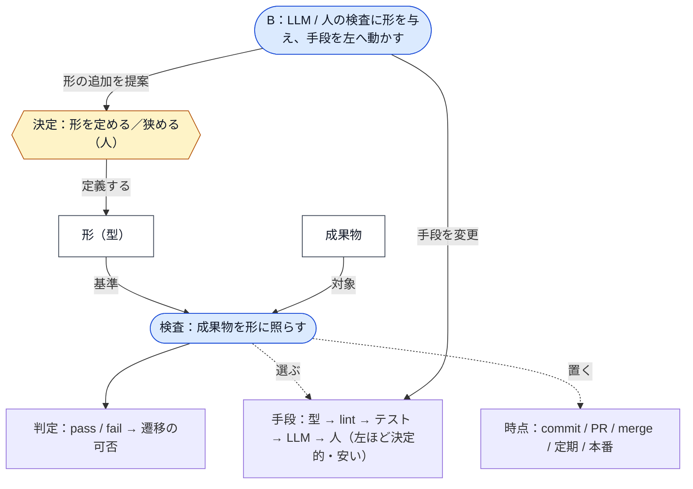
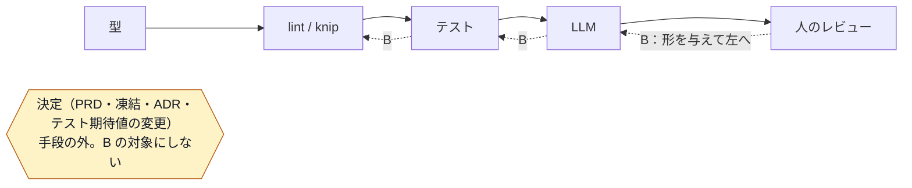

# AI による自律的な実装を支える評価・マージ構成

> **ステータス: 未合意（提案）**
> `discussions/` は規範ではない。合意した内容は `architecture/`（規範）へ昇格させ、設定変更・スクリプトは Issue 化して実装する。
> 着手候補の抽出: [autonomous-implementation-first-tasks.md](./autonomous-implementation-first-tasks.md)（直近 1 か月の PR 計測に基づく）
> 関連: [testing/strategy.md](../architecture/testing/strategy.md) / [server/architecture.md](../architecture/server/architecture.md) / [refactoring-safety-net.md](./refactoring-safety-net.md) / [api-server-security-review.md](./api-server-security-review.md) / [.claude/skills/code-review-checklist/SKILL.md](../../.claude/skills/code-review-checklist/SKILL.md)

## 何を決めたいか

AI（Claude Code）が PR の作成からマージまでを自律的に進められる構成にするために、**何を機械が判定し、何を人が判定し、判定が落ちたときに AI が何をしてよいか**を決める。

きっかけになった問い:

> PR 作成からマージまでの自動化を行いたい。現在の構成から不足しているものは何か。
> 要件仕様を満たしているか、要件漏れがないか、潜在的なバグがないか、レビュー指摘を AI がどう修正するか、マージ判断を CI に載せるべきか。

議論の過程で、これらは「評価」という一語に**対象・粒度・判定者**が混ざっていることが分かった。本ドキュメントはまず評価空間を 3 軸で整理し、そのうえでマージ基準と修正ループを定義する。

## 結論（先に）

- マージ基準は **「required status checks が全緑」∧「レビュースレッドが全て解決済み」∧「契約ファイルに触れる PR は人の承認 1 件」** の 3 条件とし、すべて GitHub のルールセットで機械的に強制する。
- CI に載せるのは**機械的に判定できるもの**（型・lint・knip・テスト・出力契約を持つ Skill レビュー）だけ。要件の網羅性や意図の正しさは PR ごとのゲートにせず、PRD / ADR を基準にした**定期評価**で見る。
- 現在欠けているのは (1) ゲートの実効化、(2) lint による違反検知の拡充、(3) フィードバックを蓄積して観点を育てるループ、の 3 つ。**レビュー観点を先に設計する必要はない**。観点はループが生む。先に決めるのは記録の形式だけ。
- 判定が落ちたときの AI の修正には禁止事項（テスト改変・契約変更・スレッド解決の範囲・ラウンド上限）を置く。
- 評価基準は遷移の出口条件でしかない。**どの遷移を AI 単独で越えてよいか**（4 → 5 → 6、契約変更なし）をライフサイクル上で定義し、PRD・設計判断・計画の凍結と観測・振り返りは人に残す（§0）。

---

## 原始概念モデル（再整理の起点）

ここまでの節は同じ空間を 7 つの分類（3 軸 / A・B・C / 変更クラス / 入口分類 / ライフサイクル / 権限表 / 🔴 分担）で切っており、互いに導出関係が無い。「評価レイヤー」がぼやけるのはこのためで、次の 3 つの原始概念に還元すると他はすべて導出できる。

| 原始概念 | 定義                                                                                                                   | 例                                            |
| -------- | ---------------------------------------------------------------------------------------------------------------------- | --------------------------------------------- |
| 成果物   | 宣言された形（型）を持つもの                                                                                           | PRD、Issue、PR、コード、テスト、schema、規範  |
| 決定     | 形を定める、または狭める**人**の行為。レイヤーを持たない                                                               | PRD の合意、契約の凍結、ADR、規範の変更       |
| 検査     | 成果物を形に照らす行為。**手段**（型 / lint / テスト / LLM / 人）と**時点**（commit / PR / merge / 定期 / 本番）を持つ | required check、code-review、トリアージ、軸 C |

- 「評価」という語は決定と検査を混ぜていた。決定は型を**定義する**、検査は型に**照らす**
- 「粒度」と「ライフサイクル段階」は同じ軸（PR 粒度 = 段階 5、チケット = 段階 4、施策 = 段階 1・3）
- 「レイヤー」は積層ではなく、**1 つの検査項目に対して選ぶ手段**を決定性の順に並べたもの

### メタモデル

### ライフサイクルへの写像

成果物（白）を列に並べ、遷移に決定（黄）か検査（青）を置く。AI（緑）が単独で越える範囲は Issue → PR → main（契約変更なし）。

```mermaid
flowchart LR
  classDef artifact fill:#ffffff,stroke:#374151,color:#111827
  classDef decision fill:#fef3c7,stroke:#b45309,color:#111827
  classDef check fill:#dbeafe,stroke:#1d4ed8,color:#111827
  classDef ai fill:#dcfce7,stroke:#15803d,color:#111827

  V["ビジョン<br/>design-core"]:::artifact
  P["PRD"]:::artifact
  PL["計画<br/>plan + interface-map"]:::artifact
  I["Issue"]:::artifact
  PR["PR"]:::artifact
  MAIN["main / デプロイ"]:::artifact
  PROD["本番"]:::artifact
  LOG["フィードバックログ<br/>逸脱ログ"]:::artifact
  NORM["規範 docs<br/>規範 ID + enforcement-inventory"]:::artifact
  LINT["lint / knip / golden set"]:::artifact

  d1{{"決定：PRD 合意"}}:::decision
  c1(["検査：要件完成度<br/>人 / PRD 時"]):::check
  d2{{"決定：契約の凍結"}}:::decision
  c2(["検査：受け入れ条件が述語か<br/>LLM / Issue 時"]):::check
  d3{{"決定：Issue 承認"}}:::decision
  ai["AI 実装<br/>Issue → PR → main を単独で越える"]:::ai
  c3(["検査：型 / lint / knip / テスト<br/>機械 / PR"]):::check
  c4(["検査：変更クラス別<br/>機械 + LLM / PR"]):::check
  c5(["検査：Skill レビュー 🔴<br/>LLM / PR"]):::check
  c6(["検査：3 条件<br/>機械 / merge"]):::check
  d4{{"決定：契約変更時のみ承認"}}:::decision
  c7(["検査：観測<br/>本番"]):::check
  c8(["検査：トリアージ<br/>人 + AI / 定期"]):::check
  c9(["検査 C：実装 vs PRD<br/>AI / 節目"]):::check
  d5{{"決定：lint 化 / 規範修正"}}:::decision
  d6{{"決定：ADR"}}:::decision
  fix["修正ループ 5b<br/>AI / 2 ラウンドまで"]:::ai

  V --> d1 --> P --> c1 --> d2 --> PL --> c2 --> d3 --> I --> ai --> PR
  PR --> c3 & c4 & c5 --> c6 --> d4 --> MAIN --> PROD --> c7 --> LOG --> c8 --> d5
  d5 --> NORM --> LINT --> c3
  NORM -.基準.-> c5
  P -.基準.-> c9 --> LOG
  ai -.規範とのズレで停止.-> d6 --> NORM
  c3 & c4 & c5 -.fail.-> fix --> PR
```

### 検査手段の選択と B の運動

### 導出される概念

| 導出概念       | 原始概念での定義                                       |
| -------------- | ------------------------------------------------------ |
| ライフサイクル | 成果物の列。遷移ごとに決定か検査を置く                 |
| ゲート         | 遷移に置かれた検査のうち、手段が機械のもの             |
| A              | 手段 = 機械、時点 = PR の検査の集合                    |
| B              | 手段 = LLM / 人 の検査に形を与え、手段を左へ変える運動 |
| C              | 時点 = 定期、対象 = 実装 vs PRD の検査                 |
| 変更クラス     | 成果物の差分から、適用する検査を選ぶ規則               |
| 権限表         | 決定のうち人が持ち続けるものの一覧（検査ではない）     |
| 🔴 分担表      | 検査項目ごとの手段の選択結果                           |

「評価レイヤー」という語はこの整理では消え、残るのは「検査項目ごとの手段の選択」の表 1 枚になる。以降の §0〜§8 はこのモデルから導出し直す対象であり、導出できない節があればそこがぼやけの正体。

---

## 0. ワークフロー（ライフサイクルと意思決定の起点）

評価基準は各遷移の**出口条件**でしかない。どこから始まり、各段階で何が入力で、誰が決め、どこに記録するかが無いと、基準を当てる対象が定まらない。AI の自律範囲も「ワークフロー上のどの遷移を AI 単独で越えてよいか」として初めて定義できる。

- 評価基準 = 各遷移の「通してよいか」
- ワークフロー = 遷移そのもの。段階・入力成果物・意思決定者・記録先
- AI の自律範囲 = AI 単独で越えてよい遷移の集合

### ライフサイクル（現状の部品を並べたもの）

| 段階               | 入力成果物       | 決めること                           | 決定者                   | 出口条件（評価）                      | 記録先                   | 現状                              |
| ------------------ | ---------------- | ------------------------------------ | ------------------------ | ------------------------------------- | ------------------------ | --------------------------------- |
| 0 意図             | ビジョン・北極星 | 何を目指すか                         | 人                       | -                                     | `product/design-core.md` | あり                              |
| 1 PRD              | 課題・仮説・計測 | 何を検証するか                       | 人                       | task-breakdown Step 0（要件の完成度） | `discussions/prd/`       | あり（ただし discussions 止まり） |
| 2 設計判断         | 規範との差分     | どう作るか、規範を変えるか           | 人                       | 決定・理由・却下案・影響規範が揃う    | `adr/`（ADR）            | #319 で新設。採用 6 件・提案 1 件 |
| 3 計画             | PRD              | 画面契約・計測・IF・タスク分解       | 人が凍結                 | task-breakdown 各 Step の完了条件     | `plans/`                 | あり                              |
| 4 Issue            | 計画             | 受け入れ条件（観察可能な述語）       | 人                       | 述語になっているか                    | GitHub Issue             | あり（テンプレートは skill 内）   |
| 5 PR               | Issue            | 実装・検証                           | **AI**                   | 軸 A ゲート + 変更クラス別チェック    | PR                       | あり                              |
| 6 マージ・デプロイ | PR               | 出してよいか                         | 機械（契約変更時のみ人） | §3 の 3 条件                          | main / Vercel            | 形骸化（§3 参照）                 |
| 7 観測・振り返り   | 計測・逸脱       | 仮説は当たったか、観点は足りていたか | 人 + AI                  | 軸 B のトリアージ、軸 C の定期評価    | **無し**                 | 欠落                              |

欠けていたのは **2（設計判断の記録）** と **7（観測・振り返り）**。2 は `docs/adr/`（ADR）の新設で埋めた（#319）。7 は未着手で、§2 の B と C がここに属する。PRD は存在するが `discussions/` に置かれたままで、「合意済みの起点」としての位置が与えられていない。

### 入口の分類（なぜ変えるか）

すべての変更が PRD から始まるわけではない。起点を変更の動機で分ける。§3 の変更クラスは「何のファイルを触るか」の分類であり、軸が違うため両方要る。

| 入口                 | 経路                                                       | 通る段階    | 例                                  |
| -------------------- | ---------------------------------------------------------- | ----------- | ----------------------------------- |
| 施策                 | PRD → 計画 → Issue → PR                                    | 1〜7 すべて | 検証ベータ（#270）                  |
| 設計変更・リファクタ | 規範を変えるなら ADR → Issue → PR。変えないなら Issue → PR | 2 or 4 から | 関数型 DDD への組み直し             |
| 不具合               | 再現手順付き Issue → PR（qa-fix の経路）                   | 4 から      | QA で見つかった表示崩れ             |
| 運用・chore          | PR のみ。変更クラス別チェックは受ける                      | 5 から      | ローカル seed 設定の修正（PR #318） |

### 意思決定の権限表（AI が単独で越えてよい遷移）

現状の skill が持つ「止まるべき地点」を集約すると次になる。

| 遷移                              | 決定者   | 備考                                                              |
| --------------------------------- | -------- | ----------------------------------------------------------------- |
| 0 → 1（PRD を書く）               | 人       | AI は下書き・論点整理まで                                         |
| 1 → 2 / 3（設計判断・計画の凍結） | 人       | task-breakdown の各 Step の完了条件をユーザーがレビューして凍結   |
| 3 → 4（Issue 起票）               | 人が承認 | AI が本文を生成し、受け入れ条件が述語になっているかを人が確認     |
| 4 → 5（実装・PR 作成）            | **AI**   | 契約が凍結済みであることが前提。契約と Issue がズレていたら止まる |
| 5 → 6（マージ）                   | **機械** | 契約ファイルに触れる PR は人の承認 1 件（§3）                     |
| 6 → 7（観測・トリアージ）         | 人 + AI  | AI が蓄積・分類し、lint 化や規範修正の採否は人                    |

AI 単独で越えてよいのは **4 → 5 → 6（契約変更なし）** の範囲。1・2・3 の凍結と 7 の判断は人に残す。

### 設計判断（ADR）の記録先と形式

`docs/adr/` に 1 決定 1 ファイル（ADR）で置く。節は Nygard 形式（背景 / 決定 / 結果）に「理由」「却下した案」「影響する規範」を足した 6 節で、ステータス（提案 / 採用 / 置換）と出所を添える（`docs/adr/README.md`）。

1. 背景（何が問題で判断が必要になったか）
2. 決定
3. 理由（判断軸）
4. 却下した案とその理由
5. 結果（得たもの・失うもの・再検討条件）
6. 影響する規範（§6 で ID が振られたらそれを指す）

役割分担は **discussions = 未合意の検討、adr = 合意した判断とその理由、architecture = 判断の結果としての規範**。`plans/` や Issue には決定の本文を書かず、ADR へのリンクだけ置く。

当初は別ディレクトリを作らず discussions → 昇格の条件に 4 点を足す案だったが、実際には決定が `plans/`（時限）の「要判断事項」や Issue の「着手前に決めること」に散り、完了後に理由が辿れなくなっていた（#319 §5 が実例）。置き場を独立させたのはこのため。

### 置き場

ライフサイクル自体は規範なので、合意後は `docs/architecture/`（例: `development-lifecycle.md`）に 1 枚置き、`docs/README.md` の 4 分割の説明とつなぐ。本ドキュメントでは検討中の位置づけとして §0 に置く。

---

## 1. 評価空間の 3 軸

「評価」を次の 3 軸に分解する。

### 軸 1: 何を評価するか（種類）

| #   | 種類         | 問い                                       |
| --- | ------------ | ------------------------------------------ |
| 1   | 意図の正しさ | その要件・施策自体が正しいか               |
| 2   | 要件の充足   | 実装が受け入れ条件を満たすか               |
| 3   | 規範への適合 | 設計ルール・レイヤー境界・命名・公開面     |
| 4   | 動作の正しさ | バグ・境界値・回帰                         |
| 5   | 品質属性     | セキュリティ・性能・アクセシビリティ・視覚 |
| 6   | 運用適合     | 移行・デプロイ・可観測性                   |

### 軸 2: どの粒度で（単位）

式・行 → 関数・モジュール → 契約（API 応答・props 型・DB schema） → PR（差分） → チケット（機能） → 施策・リリース → プロダクト

### 軸 3: 誰が・いつ（判定者と決定性）

型 → lint / knip → ユニット・統合テスト → E2E / QA シナリオ → LLM レビュー → 人のレビュー → 定期監査 → 本番観測

左ほど決定的で安く、右ほど非決定的で高い。

### 原則

**種類 × 粒度のマスは、それを判定できる最も左の層に置く。** LLM や人に置いた判定は、定期的に lint やテストへ降ろせないかを問う。

### 現状の地図

| 種類 \ 粒度  | 式・関数                                                                            | 契約                       | PR                                        | チケット・施策                           | 本番                |
| ------------ | ----------------------------------------------------------------------------------- | -------------------------- | ----------------------------------------- | ---------------------------------------- | ------------------- |
| 意図の正しさ | -                                                                                   | -                          | -                                         | design-core、task-breakdown Step 0（人） | 計測イベント（T01） |
| 要件の充足   | vitest（実行可能な仕様）                                                            | -                          | PR 本文の受け入れ条件チェック（手書き）   | qa-scenario skill（人が実行）            | -                   |
| 規範への適合 | lint（`usecase-capability-*`、`entity-behavior-has-caller`、`hook-has-test`）、knip | `response-validation` lint | code-review skill（ローカル）、CodeRabbit | -                                        | -                   |
| 動作の正しさ | vitest                                                                              | -                          | CodeRabbit、人                            | QA シナリオ                              | **無し**            |
| 品質属性     | -                                                                                   | -                          | Chromatic（paths 不一致で未稼働）         | api-server-security-review（単発）       | -                   |
| 運用適合     | -                                                                                   | drizzle migrate（CI）      | deploy-preview（成功可否のみ）            | -                                        | -                   |

空白から読めること:

- **契約粒度の列がほぼ空**。API 応答・props 型・schema の破壊的変更を検知する機械層が無い。変更クラス判定（§3）の入力にもなる場所
- **本番の列がほぼ空**。逸脱を記録する先が無く、フィードバックループ（§4）の入力源が欠けている
- **PR 粒度に人と LLM が集中**。左へ降ろせるもの（例: チェックリスト §12 Optional フォールバック）が降りていない
- **チケット粒度の要件充足が手書き**。受け入れ条件 → テストの対応が機械で読めない

---

## 2. 3 本の運用軸（A / B / C）

評価空間を運用に落とすと 3 本になる。**A は止める、B は貯めて育てる、C は定期に照らす。**

| 軸                    | 目的               | 判定者                               | タイミング                      | 出力                        | 設計ドキュメントの役割                          |
| --------------------- | ------------------ | ------------------------------------ | ------------------------------- | --------------------------- | ----------------------------------------------- |
| A. ゲート             | マージを止める     | 型・lint・knip・テスト（機械のみ）   | PR ごと、CI 上                  | pass / fail                 | **lint の出典**。各ルールが規範の節を指す       |
| B. フィードバック蓄積 | 観点を育てる       | CodeRabbit・人・QA・本番の逸脱       | PR ごとに記録、定期にトリアージ | lint 候補 / 規範修正 / 却下 | **昇格先**。抽出した規則が規範になり A へ降りる |
| C. 要件の網羅性       | 意図とのズレを見る | AI（PRD / ADR と実装・テストを比較） | 定期、または施策の節目          | ギャップ一覧 → Issue        | **入力**。PRD と ADR が比較の基準               |

- C を PR ごとに走らせない。毎回設計会議になる
- B は判定ではなく記録なので、ゲートにしない
- 「Issue が PRD を漏らしている」は task-breakdown Step 4 で止める。PR レビューで要件を再導出させない

---

## 3. マージ基準（軸 A）

### 3 条件

| 条件                                    | 機械化の手段                                                 | 現状                                  |
| --------------------------------------- | ------------------------------------------------------------ | ------------------------------------- |
| required status checks が全緑           | ルールセットに登録（型・lint・knip・テスト・Skill レビュー） | **未登録**（CI が赤でもマージできる） |
| レビュースレッドが全て解決済み          | ルールセットの conversation resolution                       | 未設定                                |
| 契約ファイルに触れる PR は人の承認 1 件 | パスベースの CODEOWNERS、または変更クラス判定ジョブ          | 無し                                  |

「レビュー指摘がなければ OK」は、CodeRabbit が必ず何か書くためそのままでは成立しない。**「未解決スレッドが無い」**に置き換えると GitHub が強制できる。

3 条件が揃えば、PR 作成時に `gh pr merge --auto --squash` を打っておくだけで人手なしにマージされる。

### 現状の乖離

- main のルールセットは「承認 1 件必須」のみで、required status checks が無い。管理者は常時バイパス可能。単独開発では自己承認できないため、実質バイパスでマージしている（承認要件は形骸化）
- `allow_auto_merge` / `delete_branch_on_merge` が無効。リモートブランチが 150 本超残っている
- 単独開発なので「承認 1 件」は正直に外し、機械ゲート + 契約変更時のみ承認、に置き換える

### 契約ファイルの宣言

変更クラス判定が読む対象として、契約ファイルのパスを規範に宣言する（案）:

- API 応答: `apps/api-server/src/app/**` の zod schema
- UI 契約: `packages/ui/src/**` の props 型
- DB: `packages/database/src/schema/**`、`packages/database/drizzle/migrations/**`

これらに触れない PR は CI 全緑で自動マージ、触れる PR は人の承認を必須にする。ただし「契約に触れるか」の 2 値では足りない。変更の種類ごとに追加で見る観点が異なるため、次節の変更クラスに展開する。

### 変更クラスと追加チェック

「変更の種類によって、CI の共通ゲートとは別に見なければならない観点」を棚卸しした結果。評価地図では**契約列と運用適合行**にあたる。大半はパスや差分の grep で機械判定でき、人が残るのは方針判断だけ。

#### 変更の種類ごとの観点

**1. データ整合性（スキーマ・データ移行）**

- 更新処理の対象範囲。一回限りの是正 UPDATE（例: `0011_demote_unpublishable_profiles.sql`）は、WHERE が「直したい行だけ」に閉じているか、冪等か、本番の行数で実行時間とロックが許容範囲か
- 後方互換。`db-migrate` → `deploy` の順なので、**マイグレーション適用時点では旧コードが動いている**。列削除・NOT NULL 追加・rename は旧コードを壊す。expand / contract の 2 段階に分ける
- Drizzle に down マイグレーションが無い。ロールバックは「前方修正のみ」と明記する
- マスタ行の変更。`link_types` 等の削除・code 変更は FK で参照する既存行に影響する。seed の `ON CONFLICT DO NOTHING` は追加にしか効かない
- **Preview DB が単一**。`DATABASE_URL_PREVIEW` が 1 本のため、複数 PR のマイグレーションが同じ DB に順不同で当たる。ブランチ A の schema 変更がブランチ B の Preview に混ざる。自律マージで PR 数が増えると顕在化する

**2. 環境・設定**

- 環境変数の追加は 5 か所を揃える: Vercel env（Terraform 管理）、GHA Secrets、`turbo.json` の `env` 列挙（漏れるとビルドキャッシュが古い値を使う）、`.env.example`、`setup.sh`
- local / preview / production の 3 環境に同じ変数が揃っているか
- Supabase Storage バケット、Auth0 の callback URL、Redis 等の外部設定は環境変数だけでは済まない

**3. 契約・互換性（デプロイ順序）**

- api-server と beatfolio は別デプロイなので、API 応答の破壊的変更は**両者が同時に切り替わらない瞬間**を生む。フィールド追加は安全、削除・rename は 2 段階
- props 型変更に Storybook の stories が追随しているか
- URL 変更は redirect（`routing.md`、`handle-history.md`）
- 計測イベントの名前・props 変更は集計側の継続性を切る。T01 で作った基盤の契約として扱う

**4. 運用・可観測性**

- 新しいエラーの `errorMap` 登録、ログの PII マスク
- キャッシュ無効化（`revalidateTag`）の対象漏れ
- インデックス追加の要否

**5. セキュリティ・依存**

- 新エンドポイントの認可（capabilities lint で一部機械化済み）
- Dependabot の報告（2026-09-20 時点で 12 件、critical 2）。自動マージの対象に依存更新を含めるなら扱いを先に決める

**6. 知識の更新**

- 規範 docs、CLAUDE.md のハブ、該当 Skill、QA シナリオが変更に追随しているか

#### 変更クラス → 追加チェック → 判定者

| 変更クラス               | 検知（パス・差分で機械判定）         | 追加チェック                                 | 判定者                  |
| ------------------------ | ------------------------------------ | -------------------------------------------- | ----------------------- |
| schema / migration       | `packages/database/**`               | 後方互換、UPDATE の対象範囲、Preview DB 競合 | LLM + 人                |
| 環境変数                 | `process.env.*` の新規参照           | 5 か所の同期                                 | 機械（grep で差分検出） |
| API 契約                 | `apps/api-server/src/app/**` の zod  | 追加のみか、削除・rename か                  | 機械（schema diff）+ 人 |
| UI 契約                  | `packages/ui/src/**` の props 型     | stories 追随                                 | 機械                    |
| 計測                     | イベント名・props の定義ファイル     | 集計側との整合                               | 人                      |
| URL                      | `apps/beatfolio/src/app/**` のルート | redirect                                     | LLM                     |
| 依存                     | lockfile                             | 脆弱性・破壊的変更                           | 機械 + 方針             |
| 上記いずれにも該当しない | -                                    | 共通ゲートのみ                               | 機械（自動マージ可）    |

変更クラス判定ジョブは PR の差分パスからクラスを付け、該当クラスの追加チェック一覧を PR コメントに出す。人の承認が要るクラスは required reviewer に落とす。

### Skill レビューを status check にする条件

非決定的な判定をゲートに入れるには**出力契約**が要る。

- 対象はチェックリストの 🔴 項目（§3 スコープ条件、§4 権限・機密露出、§10 トランザクション境界、§12 Optional フォールバック、§15 テストの変更検知）のみ、diff 内のみ
- 項目ごとに `pass / fail / not-applicable` と根拠の `file:line` を返す。fail が 1 つでもあれば check を赤にする
- それ以外の所見（🟡 / ⚪）はスレッドとしてコメントに出し、B へ流す
- 判定と実装を同じコンテキストにやらせない（現在の code-review skill はサブエージェントで動くため満たしている）
- 観点ごとに「必ず落ちる diff」「必ず通る diff」の golden set を持ち、チェックリストやプロンプトを変えたら回す（検証器のテスト。lint ルールの `eslint.rules.test.mts` と同じ位置づけ）

### 🔴 項目のレイヤー分担（見立て）

| 項目                        | 主担当     | 機械判定できる部分                                                                   | LLM / 人が残る部分                 |
| --------------------------- | ---------- | ------------------------------------------------------------------------------------ | ---------------------------------- |
| §12 Optional フォールバック | lint       | `?.` 直後の `?? ""` / `?? 0` / `?? []` / `?? false` を `no-restricted-syntax` で全件 | 「その値は必須か任意か」           |
| §3 スコープ条件             | lint + LLM | 引数で受けた `teamId` / `userId` が関数内で未参照                                    | where 句に効いているか             |
| §10 トランザクション境界    | lint + LLM | 1 usecase 内で `txRunner.run` 無しに save が 2 回                                    | 業務上まとめるべきか               |
| §4 権限・機密露出           | LLM + 人   | Error / logger のテンプレート文字列に email / sub 変数                               | 権限モデルに照らした判断           |
| §15 テストの変更検知        | テスト基盤 | schema 差分行の差分カバレッジ、`objectContaining` の禁止                             | 同型フィールドの取り違えが見えるか |

---

## 4. 判定が落ちたときの AI の修正ループ

無制限に直させると「テストを弱める」「契約を変える」「ループする」の 3 つが起きる。

### やってよい修正・止める修正

| 失敗の種類                                                 | AI の対応                                                                                   |
| ---------------------------------------------------------- | ------------------------------------------------------------------------------------------- |
| 型・lint・knip                                             | 自動修正可                                                                                  |
| テスト                                                     | **実装側の修正のみ可**。既存テストの期待値変更・削除・skip は人の承認が要る（テスト＝仕様） |
| 契約ファイルを触る修正                                     | 分類に関係なく人の承認が要る                                                                |
| レビュースレッド（適合性違反、チェックリスト項目を指せる） | 修正して解決                                                                                |
| レビュースレッド（設計判断・意図）                         | 自動修正しない。選択肢を返し、**人が解決**する                                              |
| レビュースレッド（質問）                                   | 回答のみ。スレッドの解決は**人が行う**（疑問が消えたかは質問した側が判断する）              |

### ループ制御

- 同じ check への修正は 2 ラウンドまで。3 回目は人にエスカレーション
- 修正前に 1 回リランする（flaky 対策）
- 修正は 1 コミット 1 原因。コミット本文に対象の check 名かスレッド URL を書く（これが B の記録になる）
- AI が解決してよいスレッドは「自分が修正コミットを紐づけたもの」だけ。bot（CodeRabbit）のスレッドに bot が応答しない
- 起動はまずローカル（ユーザーが Claude Code を起動）。ポリシーが安定してから `check_run` 失敗や `@claude` をトリガーにした Action へ移す

---

## 5. フィードバック蓄積（軸 B）

### 先に決めるのは観点ではなく記録の形式

観点は蓄積から導く。1 件のフィードバックに最低限必要な項目:

| 項目                 | 内容                                   |
| -------------------- | -------------------------------------- |
| 出所                 | CodeRabbit / 人 / QA / 本番            |
| 位置                 | PR 番号、ファイル、行                  |
| 要約                 | 指摘内容                               |
| 対応                 | 修正した / 却下した / 保留、とその理由 |
| 分類（トリアージ後） | lint 化 / 規範修正 / 一過性            |
| 規範 ID              | 紐づく規範の節（§6 参照）              |

### 運転

- マージ時に PR の CodeRabbit コメント・人のコメント・解決済みスレッドをスクリプトで取り込む（`token-report` skill が PR 単位で集計してコメントを投稿する形を持っており、同じ形で作れる）
- 10 PR か 2 週間ごとにトリアージし、lint 候補は A へ、規範修正は `docs/architecture/` へ
- 置き場は規範ではないので `docs/discussions/` 配下か `.claude/` 配下

### 観点の設計をどう担保するか

観点の網羅性は事前に証明できない。担保できるのは次の性質:

1. **由来がある**: どの規範を実装し、どの失敗を防ぐか。由来の無い観点は削れない
2. **反証可能である**: 必ず落ちる例と必ず通る例のフィクスチャがある（golden set）
3. **最も決定的な層に置く**: LLM 判定の観点は定期的に lint へ降ろせないか問う
4. **逸脱から更新する**: QA・本番で見つかった不具合について「どの種類 × 粒度で止まるべきだったか → どの観点が無かったか」を記録し、観点を足す・直す
5. **発火しない観点を疑う**: N 件の PR で一度も発火しない、または毎回発火する観点は見直す

「要件そのものが正しいか」はこの仕組みで担保できない。`design-core.md` と task-breakdown Step 0 が担う人の領域として、意図的に自動化の外に置く。

---

## 6. 設計ドキュメントの役割と前提

### アーキテクチャ自体の評価

現在のアーキテクチャは検証に向いた形になっている:

- 層が明示され、Functional Core / Imperative Shell で純粋なドメインが分離されている
- 契約の置き場が固定されている（zod / props 型 / drizzle schema）
- 規範 → 機械検証のリンクが一部あり、lint ルール自体にテストがある
- docs が規範 / 時限 / 検討で分かれ、「規範が正、コードは結果」の原則がある

欠けているのは**検証用のメタデータ**であり、構造の欠陥ではない:

| 弱み                                                                | 影響                                                       |
| ------------------------------------------------------------------- | ---------------------------------------------------------- |
| 規範に ID が無い（architecture.md が約 1,200 行で規範と説明が混在） | lint・フィードバック記録・LLM プロンプトから規範を指せない |
| 規範 → 検証手段の対応表が無い                                       | 何が lint で落ち、何が LLM 任せかを一覧できない            |
| 機械検証がサーバー偏重（knip は api-server のみ）                   | 同じ 🔴 でも層によって担保の強さが違う                     |
| 契約ファイルの宣言が無い                                            | 変更クラス判定が読む対象が無い                             |

### ドキュメントに足すもの

1. 規範の節への ID 付与（分割は不要）
2. `enforcement-inventory.md`（規範 ID → 検証手段）。空欄が「担保されていない規範」を示す
3. 契約ファイルの宣言
4. チェックリストへの列追加（由来 / 判定述語 / 担当レイヤー / フィクスチャ）

ADR は `docs/adr/` に置く（§0「設計判断（ADR）の記録先と形式」）。discussions → 昇格の流れは未合意の検討にだけ使い、合意時に ADR を切ってから規範を更新する。

---

## 7. 現状の棚卸し（2026-09-20 時点）

### CI の穴

| 項目                                     | 状態                                                                 |
| ---------------------------------------- | -------------------------------------------------------------------- |
| packages/database・packages/ui の vitest | CI で未実行（`--filter=api-server` は依存パッケージを含まない）      |
| beatfolio.yml                            | lint と build のみ。テストは deploy-preview 側でしか走らない         |
| api-server のテスト                      | api-server.yml と deploy-preview の test-api-server で二重実行       |
| Chromatic                                | paths が `src/components/**` で存在しないパス。一度も起動していない  |
| Node バージョン                          | 20 / 22.12.0 / `env.NODE_VERSION` が混在。`.nvmrc` と `engines` なし |
| knip                                     | api-server のみ対象                                                  |
| pre-commit                               | prettier のみ。ESLint は CI 任せ                                     |
| E2E                                      | 設計候補のまま先送り（`e2e-strategy.md`）                            |

### 足場

- PR テンプレート・CODEOWNERS・`dependabot.yml` が無い（Dependabot は UI 設定で稼働）
- CodeRabbit は `auto_review` 設定だが、PR #318 では "manual review required for this OSS repository" でスキップされた（CodeRabbit 側の設定）
- Claude 側の `code-review` / `qa-scenario` / `token-report` skill はローカル専用で CI に接続されていない

---

## 8. 着手順

| Phase | 内容                                                                                                                                                                                                                 | 設計の要否       |
| ----- | -------------------------------------------------------------------------------------------------------------------------------------------------------------------------------------------------------------------- | ---------------- |
| 0     | ゲートの実効化: CI を `ci.yml` に一本化（全 workspace を対象、deploy は `needs` で待つ）、Chromatic の paths 修正、Node 統一、ルールセットに required checks と conversation resolution を登録、管理者バイパスを外す | 不要（設定変更） |
| 1     | 自動マージ: `allow_auto_merge` / `delete_branch_on_merge` 有効化、squash 統一、PR 作成時に `gh pr merge --auto`、CodeRabbit スキップの解消、§12 の lint 化                                                           | 不要             |
| 2     | B の器: 記録形式の確定、マージ時にコメント・スレッドを取り込むスクリプト、トリアージの周期                                                                                                                           | **記録形式のみ** |
| 3     | Skill レビューの status check 化: 出力契約、golden set、修正ループの禁止事項を規範化。規範への ID 付与と `enforcement-inventory.md`                                                                                  | 短い規範 1 枚    |
| 4     | C: PRD / ADR を入力に実装・テストを照らす skill を作り、施策の節目で回す。B が数回転してから                                                                                                                         | 後で             |

Phase 0 は自動マージの前提。ここを飛ばすと「赤い CI のまま自動でマージされる」状態になる。

---

## 未決事項

- Skill レビューの status check は GitHub Action（`claude-code-action`）で走らせるか、ローカル実行の結果を commit status として投稿するか
- フィードバック記録の置き場（`docs/discussions/` 配下か `.claude/` 配下か）と形式（Markdown 表か NDJSON か）
- 契約ファイルの宣言の粒度（ディレクトリ単位か、型名まで指すか）
- 本番観測（エラー率・レイテンシ）をどこで取るか。B の入力源として必要だが、現状は計測イベント以外に無い
- `refactoring-safety-net.md` の提案 1（entrypoint テストを本番と同じ結線で回す）は本ドキュメントの「契約粒度の空白」を埋める候補。統合して扱うか
- **Preview DB が単一である問題**。PR ごとの Supabase ブランチ（Branching）を使うか、Preview ではマイグレーションを流さず main マージ後のみにするか、schema 変更 PR は直列化するか
- スキーマ変更の expand / contract を規範（`database/migration.md`）に書くか。down が無い前提でのロールバック方針も同時に
- 変更クラス判定ジョブの実装形態（GitHub Action か、PR 作成時に Skill が付けるラベルか）
- 依存更新（Dependabot）を自動マージの対象に含めるか。含めるなら patch / minor のみか
- 評価ドキュメント自体の作り方（本ドキュメントを規範へどう分割・昇格するか）は別途検討する
- PRD を `discussions/` から「合意済みの起点」へどう昇格させるか（`product/` 配下に置くか、`plans/` と対にするか）
- ライフサイクル（§0）を `docs/architecture/development-lifecycle.md` として独立させる時期。`docs/README.md` の 4 分割・昇格ルールとの統合方法
- 入口の分類（なぜ変えるか）を PR や Issue のラベルとして機械可読にするか
