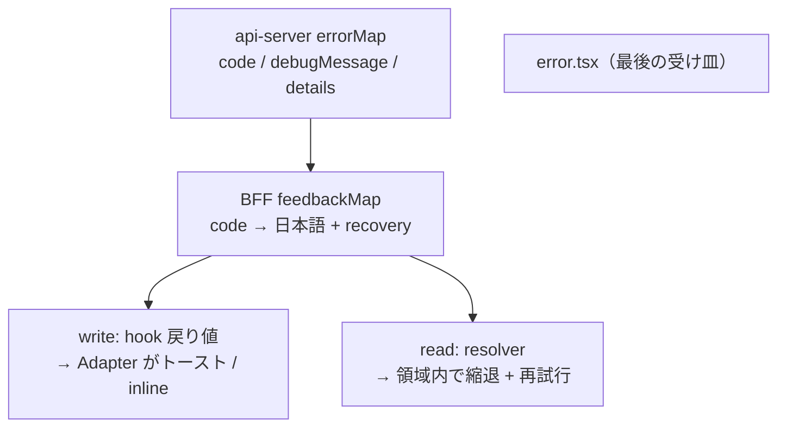

# エラーをユーザーに伝え、次の動きを促す（タグ / 日本語文言 / 内部向け英語の分離）

> **ステータス: 未合意（提案）**
> `discussions/` は規範ではない。合意した内容だけを `architecture/` へ昇格させる。
> 関連: [toast-feedback-design.md](./toast-feedback-design.md)（トーストを**どこに置くか**）／ 本書（**何を出すか**）は補完関係にある。
> 関連規範: [bff/design.md](../architecture/frontend/bff/design.md) / [error-handling/](../architecture/server/error-handling/README.md) / [routing.md](../architecture/frontend/routing.md)

## 何を決めたいか

失敗したときに **ユーザーが操作を続けられる状態を保ったまま、何が起きたかを伝え、次の動きを促す**ための設計を決める。

具体的には、1つのエラーを次の3つの宛先に分けて出す形を確定させたい。

| 宛先                  | 何を               | 持つ場所               | 読む人                                 |
| --------------------- | ------------------ | ---------------------- | -------------------------------------- |
| **タグ（`code`）**    | 機械可読な識別子   | api-server             | プログラム（BFF / UI が分岐する）      |
| **内部向け英語**      | 何が起きたかの説明 | api-server             | 開発者（ネットワークタブ・エラー通知） |
| **日本語 + 次の動き** | 文言と復帰手段     | **BFF**                | エンドユーザー                         |
| ログ                  | 調査用の構造化情報 | api-server（**既存**） | 運用                                   |

## 前提とする方針

> **エラーで画面を落とさない。他の操作ができる状態を前提にして、失敗を画面内で伝える。**
> そのうえで、伝えた情報をもとに**次に取れる行動**を提示する。

ただし例外が1つある。**「壊れているのに壊れていないように見せる縮退」は選べない。**

取得に失敗したリストを空配列にフォールバックして「プレイヤーがいません」と表示すれば、画面は操作可能で他の導線も生きている。しかしこれは嘘であり、ユーザーは「まだ誰も登録していない」と誤って納得して離脱する。これは [`code-review-checklist.md`](../../.claude/rules/code-review-checklist.md) §11-3（未取得と0件を区別する）・§12（`?? []` で必須値を埋めない）と同じ話で、既存原則から直接禁止が導ける。

**「操作可能である」と「失敗を隠さない」の両立が必須条件**であり、前者のために後者を捨てることは認めない。

---

## 現状

### 器はある

`errorMap` はすでに **クライアント向け（`client*`）と内部ログ向け（`log*`）の2宛先分離**が実装済み（`apps/api-server/src/errorMap/index.ts:59-64`）。設計としてクライアント向けの枠は切られている。

### 中身がクライアント向けになっていない

**1. 文言が開発者向け英語** — 定義済み 22 エラーすべて。

```ts
InvalidEmailFormatError: clientMessage: () => "Invalid email format"; // :115
UserAlreadyRegisteredError: clientMessage: () => "User already registered"; // :89
ProfileNotPublishableError: clientMessage: () =>
  "Profile is not publishable: required fields are missing"; // :145
```

**2. 機械可読な識別子が落ちている** — `AppError["type"]` はログ側にしか残らず、レスポンスボディは `{ error: string; details?: unknown }`（`:200`）。UI が分岐する手がかりがない。

**3. `clientMessage` に入力値が埋まっている** — `logFields` には構造化して出しているのに、メッセージにも文字列連結されている。[`code-review-checklist.md`](../../.claude/rules/code-review-checklist.md) §4-3 に反する。

```ts
AccountIdAlreadyTakenError: clientMessage: (error) =>
  `Account ID already taken: ${error.accountId}`; // :104
```

### その英語がそのまま画面に出ている

```ts
// apps/beatfolio/src/app/dashboard/profile/edit/.../useSaveProfile/index.ts:18
throw new Error(data.error || "プロフィールの保存に失敗しました");
```

`data.error` が**先**なので、日本語フォールバックが使われるのは `error` が欠けたときだけ。通常はサーバーの英語がユーザーの画面に出る。同型が `useSaveProfile:18,28` と `useCreateUser:32` にあり、write 系 hook 4 つすべてが同じ構造。

`ProfileNotPublishableError` の場合、ユーザーは日本語のプロフィール編集画面で `Profile is not publishable: required fields are missing` を読まされる。しかも **`clientDetails.missingFields`（どの項目が足りないか）は送られているのに使われていない**。

### read 失敗は行き止まりになっている

`page.tsx` の read 失敗は 4 画面すべてが素の `throw` で、受け皿の `error.tsx` / `global-error.tsx` / `not-found.tsx` が**1つも存在しない**。

| 箇所                                                        | コード                                                   |
| ----------------------------------------------------------- | -------------------------------------------------------- |
| `apps/beatfolio/src/app/players/page.tsx:9`                 | `throw new Error("Failed to fetch players")`             |
| `apps/beatfolio/src/app/dashboard/page.tsx:22`              | `throw new Error("Failed to fetch dashboard")`           |
| `apps/beatfolio/src/app/dashboard/settings/page.tsx:21`     | `throw new Error("Failed to fetch settings")`            |
| `apps/beatfolio/src/app/dashboard/profile/edit/page.tsx:19` | `throw new Error("Failed to fetch profile edit screen")` |

本番ビルドではこのメッセージは**ユーザーに表示されない**（Next.js が digest に置換する）。実際に出るのは `Application error: a server-side exception has occurred` + ハッシュのみで、ナビゲーションもリトライもない。**ユーザーにも開発者にも何も伝わらない行き止まり**になっている。

これは [`bff/design.md:272`](../architecture/frontend/bff/design.md) に「`page.tsx` 側の失敗表示（`error.tsx` / リトライ）は未設計」として既知の穴と明記されている箇所。

---

## 論点

### 1. `throw` 自体は禁じ手ではない

RSC で失敗を上に投げるのは正規の経路。問題は **失敗の種類を1つに潰していること**と**受け皿がないこと**の2つ。

| 失敗                              | あるべき扱い              | 現状                                           |
| --------------------------------- | ------------------------- | ---------------------------------------------- |
| 対象が存在しない（404）           | `notFound()` → 専用 UI    | 一律 `throw` に潰れる                          |
| 上流が落ちている（502 / timeout） | 画面内で縮退 + リトライ   | 素の 500                                       |
| 認証が切れた（401）               | `redirect("/auth/login")` | 素の 500（ログインし直せば直るのに行き止まり） |
| 画面の一部だけ欠けた              | その領域だけ縮退          | ページ全体が落ちる                             |

### 2. トーストは write 用、read には効かない

[`bff/design.md`](../architecture/frontend/bff/design.md) の「read は厚く write は薄い」と同じ非対称がフィードバックにも現れる。

| 種別      | 起点                         | 適した表現                    | 理由                                                     |
| --------- | ---------------------------- | ----------------------------- | -------------------------------------------------------- |
| **write** | ユーザー操作（保存ボタン等） | トースト                      | 操作と結果が因果で繋がっている                           |
| **read**  | 初期描画                     | **領域内の縮退表示 + 再試行** | ユーザーは何もしていない。通知が飛んで本体が空、は不自然 |

`/players` なら「ヘッダーとナビは生きたまま、リスト領域だけが『読み込めませんでした／再試行』になる」形。

### 3. 日本語文言を api-server と BFF のどちらが持つか

**BFF が持つ**。[`bff/design.md:47`](../architecture/frontend/bff/design.md)「表示語彙の解決は BFF が担う（マスタ参照モデル）」がそのまま適用できる。`code → label` の解決と同じ構図であり、api-server はドメインに専念する。マルチクライアント化（[multi-client.md](../architecture/frontend/bff/multi-client.md)）した際も、文言だけクライアント側で差し替えられる。

### 4. 22 種類のエラーに 22 通りの UI を書くと破綻する

**ユーザーが次に取れる行動は数種類しかない**ので、そこへ畳む。分類の軸は HTTP ステータスでもエラー型でもなく〈取れる行動〉。

---

## 案

### 1. タグ（`code`）— `AppError["type"]` をそのまま使う

新しい語彙（`ACCOUNT_ID_ALREADY_TAKEN` 等）は作らない。`errorMap` が mapped type で全 `type` に entry を要求しているため **1:1 が型で保証済み**であり、別語彙を作ると「型と code の二重管理」になって必ずズレる。

**トレードオフ**: ドメインのエラー型名をリネームすると契約が変わる。ただし同一モノレポの同時デプロイであり、実害は「BFF 側がコンパイルエラーになる」だけ。検知できる方が望ましいと判断する。

実装は `errorMap` へのフィールド追加すら不要で、`buildClientResponse`（`:219-228`）が `code: error.type` を足すだけでよい。

BFF 自身のエラー（`UpstreamUnavailableError`、`apps/beatfolio/src/errorMap/index.ts:23-28`）にも同じく `code` を出す。消費側から見れば「api-server 由来か BFF 由来か」は関心事ではなく、**code の union 1つ**として扱える。

```ts
// apps/api-server/src/errorMap/index.ts
export type AppErrorCode = AppError["type"];

// apps/beatfolio/src/errorMap/index.ts
export type BffErrorCode = BffError["type"];

// 消費側から見える1つの語彙
export type ErrorCode = AppErrorCode | BffErrorCode;
```

`apps/beatfolio/src/utils/client/index.ts:2` が既に api-server の型を相対 import しているため、**この型共有は現行構成のまま成立する**。

### 2. 内部向け英語 — `clientMessage` を `debugMessage` にリネーム

中身は現状の英語をそのまま流用し、変えるのは名前だけ。狙いは2つ。

- 「これは UI に出すものではない」が名前から自明になる（§11-2 自己説明性）
- `data.error` を読んでいる write 系 hook 4 つが**コンパイルエラーになり、移行が強制される**

素通しをやめる理由は UX だけでなく、`debugMessage` に内部情報が入った瞬間の漏洩を構造的に防ぐため。**「サーバーの文字列を画面に出さない」を規約にすれば、その事故は起きなくなる。**

あわせて `:104` の PII 連結を潰す。

```ts
// before
clientMessage: (error) => `Account ID already taken: ${error.accountId}`

// after — 識別子はメッセージでなく構造化フィールドへ（§4-3）
debugMessage: () => "Account ID already taken",
clientDetails: (error) => ({ accountId: error.accountId }),
```

### 3. 日本語メッセージ + 次の動き — BFF に1枚のマップを置く

```ts
type Recovery =
  | { kind: "retry" }
  | { kind: "correct" }
  | { kind: "reauth" }
  | { kind: "navigate"; to: string; label: string }
  | { kind: "none" };

type Feedback = { message: string; recovery: Recovery };

const feedbackMap: Record<ErrorCode, Feedback> = { ... };
```

22 種類は 5 種類の `recovery` に畳まれ、**エラーが増えても UI 側は無変更**になる。

| recovery   | 該当 code                                                                              | 日本語（例）                         | 次の動き             |
| ---------- | -------------------------------------------------------------------------------------- | ------------------------------------ | -------------------- |
| `reauth`   | `UnauthorizedError`                                                                    | セッションの有効期限が切れました     | ログイン画面へ       |
| `retry`    | `UpstreamUnavailableError`                                                             | 接続できませんでした                 | 再試行ボタン         |
| `correct`  | `Invalid*FormatError` ×13 / `InvalidRequestFormatError` / `ProfileNotPublishableError` | 入力内容を確認してください           | 該当欄へ inline      |
| `correct`  | `EmailAlreadyTakenError` / `AccountIdAlreadyTakenError`                                | このアカウントIDは既に使われています | 別の値を入力         |
| `navigate` | `UserNotFoundError` / `ArtistNotFoundError` / `ArtistProfileNotFoundError`             | お探しのページは見つかりませんでした | 一覧へ戻る           |
| `navigate` | `UserAlreadyRegisteredError`                                                           | すでに登録が完了しています           | **ダッシュボードへ** |
| `none`     | `InvalidSubFormatError`                                                                | 問題が発生しました                   | 問い合わせ導線       |

`UserAlreadyRegisteredError` が方針をよく表す例。現在は onboarding で 409 の英語が出て終わりだが、これは**ユーザーにとって成功に近い状態**であり、正しい次の動きは「ダッシュボードへ行く」。エラーを行き止まりにしない、とはこういうことを指す。

#### 項目レベルは Feedback と分ける

`ProfileNotPublishableError.missingFields` と `InvalidRequestFormatError.issues` は、message + action とは**別の UI 機構**（欄ごとの inline 表示）なので混ぜない。

```ts
type ErrorPresentation = {
  feedback: Feedback; // 画面レベル：文言 + 次の動き
  fieldErrors?: FieldError[]; // 項目レベル：どの欄が悪いか
};
```

`ProfileNotPublishableError` は現在 `missingFields` を送っているのに捨てているため、ここを繋ぐだけで「どの項目が足りないか」までユーザーへ届く。

#### 未知の code のフォールバック

BFF が知らない code（api-server の先行デプロイ、想定外の 500）は **status から導出**する。`code` が無くても status は必ずあるので、ここで詰まない。

| status | message                          | recovery |
| ------ | -------------------------------- | -------- |
| 5xx    | 時間をおいて再度お試しください   | `retry`  |
| 4xx    | リクエストを処理できませんでした | `none`   |

### 4. レスポンスの形

```ts
// before
{ error: string; details?: unknown }

// after
{ code: ErrorCode; debugMessage: string; details?: unknown }
```

### 5. 消費側



| 経路            | 実装                                                                                                                                                                                                                                    |
| --------------- | --------------------------------------------------------------------------------------------------------------------------------------------------------------------------------------------------------------------------------------- |
| **write**       | hook は state ではなく**戻り値**で `ErrorPresentation` を返す。[toast-feedback-design.md](./toast-feedback-design.md) の論点2（クロージャが古い値を掴む）がそのまま解決する。Adapter が `recovery.kind` を見てトースト or inline を選ぶ |
| **read**        | [`bff/design.md:274-315`](../architecture/frontend/bff/design.md) の resolver に `{ kind: "degraded"; presentation }` を追加。ページを落とさず、その領域だけ「読み込めませんでした + 再試行」にする                                     |
| **`error.tsx`** | 描画中の想定外例外はゼロにできないため、**最後の受け皿**として最小構成で置く（主経路ではない）                                                                                                                                          |

---

## この設計でコンパイラが保証すること

本案の主眼はここにある。**運用でカバーする設計にしない。**

1. api-server にエラーを追加 → `errorMap` の mapped type が entry を要求（**既存の性質**）
2. その entry が増える → BFF の `Record<ErrorCode, Feedback>` が**コンパイルエラー**になり、日本語文言と次の動きの定義を強制する
3. `data.error` を読んでいる箇所は `debugMessage` へのリネームで**すべてコンパイルエラー**になり、移行漏れが出ない

「エラーを追加したのに日本語がない」「次の動きが決まっていない」が**型で起きなくなる**。現行 errorMap の思想（HTTP への翻訳を errorMap だけが行う）の延長線上にある。

---

## 段取り（案）

| 順  | 内容                                                                                                                                | 範囲                         |
| --- | ----------------------------------------------------------------------------------------------------------------------------------- | ---------------------------- |
| 1   | `errorMap` の client 出力に `code` を追加、`clientMessage` → `debugMessage` にリネーム、`:104` の PII 連結を `clientDetails` へ移す | api-server（既存テストあり） |
| 2   | BFF の `errorMap` にも `code` を出し、`ErrorCode` union を確定                                                                      | beatfolio                    |
| 3   | BFF に `feedbackMap`（`code → message + recovery`）と未知 code フォールバックを置く                                                 | beatfolio                    |
| 4   | write 系 hook 4 つを `ErrorPresentation` 戻り値へ移行（1 でコンパイルエラーになる箇所）                                             | beatfolio                    |
| 5   | read の resolver に `degraded` を追加し、領域単位の縮退 + 再試行を実装                                                              | beatfolio                    |
| 6   | `error.tsx` を最小構成で設置                                                                                                        | beatfolio                    |

---

## 決めるべきこと（未合意）

1. `code` を `AppError["type"]` 直結にするか、独立した語彙を切るか（本書の推奨は**直結**）
2. `clientMessage` → `debugMessage` のリネームを行うか。行わない場合、素通しを禁じる別の担保をどう置くか
3. `Recovery` の語彙を 5 種（`retry` / `correct` / `reauth` / `navigate` / `none`）で確定するか
4. **`recovery.navigate` の遷移先 URL を BFF が持ってよいか** — BFF が画面 URL を知ることになる。BFF は画面単位の層なので許容範囲と考えるが、[routing.md](../architecture/frontend/routing.md) との整合を要確認
5. 日本語文言の置き場を BFF 内のどこにするか（`src/errorMap/` は HTTP 翻訳の責務なので、別モジュールに分ける想定）
6. i18n を将来の要件として構造に織り込むか、当面 ja 固定とするか

## 合意後の昇格先

| 決まった内容                                           | 昇格先                                                                 |
| ------------------------------------------------------ | ---------------------------------------------------------------------- |
| `code` / `debugMessage` / `details` のレスポンス契約   | `architecture/server/error-handling/implementation.md`                 |
| 表示文言と `recovery` を BFF が持つ責務分担            | `architecture/frontend/bff/design.md`（「エラー契約」節）              |
| read 失敗時の縮退表示と resolver の `degraded`         | `architecture/frontend/bff/design.md`（`:272` の「未設計」を埋める）   |
| write のフィードバック発火とトースト / inline の線引き | [toast-feedback-design.md](./toast-feedback-design.md) の昇格先に従う  |
| 「壊れているのに壊れていないように見せない」原則       | `.claude/rules/code-review-checklist.md`（§11-3 / §12 の関連項として） |
