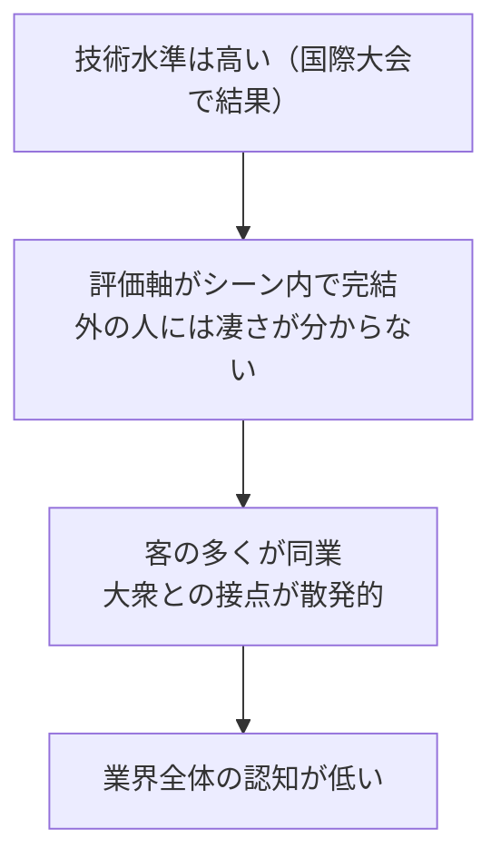
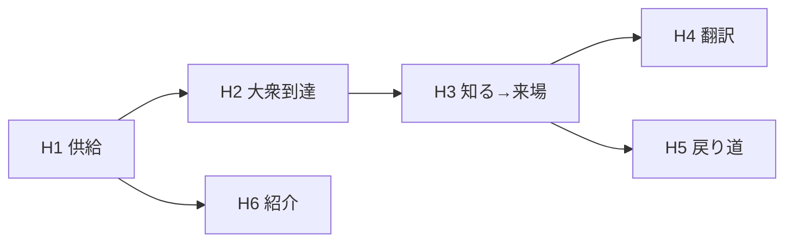

# 検証 PRD — 「知る → 応援する」を個人単位で成立させる

> [`design-core.md`](../../../product/design-core.md) の「最初の課題＝アーティストが知られる状態を作る」を、**業界全体ではなく個人単位**に分解して検証するための PRD。
> 施策の定義・検証仮説・指標・判断基準・ベータ設計をひとつにまとめる。**未合意（discussions）**。合意した項目から `product/` と `plans/` へ昇格させる。

---

## 0. 結論サマリ

- 業界の潜在課題は**大衆からの認知の欠如**。原因は「外の人に凄さが伝わらない」構造にあり、個々の努力では埋まらない。
- 業界全体を一度に動かすのは不可能なので、**シーンの外に出たい中堅層の個人**（有名層は自前の媒体を持つため対象外、新人層は検証不能）を選び、その人が大衆に「知られ → 応援される」一周を成立させる。積み重なった結果として業界の認知が動く。
- beatfolio が直接担うのは **知る → 応援する**。発見はプロダクトの外（SNS・動画）で起きる前提に置く。
- 「応援する」の最低ラインを **ライブに来た** と定義する。フォロー・SNS 遷移は先行指標であり、成果ではない。
- beatfolio の位置づけは**アーティストの「公式」の起点**（書く → 素材が出る → SNS に流す）。SNS との差は機能ではなく向き。
- ビートボックス固有の要素は **翻訳**（内側でしか通じない価値を外の人の言葉に変える）。ここを持つかどうかで汎用プロフィールサービスと分かれる。
- 検証は一覧を公開せず、**ベータ 5〜8 人 × 6〜8 週間**で行う。北極星は「ビートボクサー以外の来場者数」。

---

## 1. 位置づけと前提

| 参照先                                                                            | 引き継ぐもの                                                            | 本書での扱い                                           |
| --------------------------------------------------------------------------------- | ----------------------------------------------------------------------- | ------------------------------------------------------ |
| [`design-core.md`](../../../product/design-core.md)                               | ビジョン・最初の課題・Discover→Understand→Support・ジョブ三層・計測三層 | 起点。§10 に更新提案を書く                             |
| [`flow-design.md`](../../../product/flow-design.md)                               | 入口の範囲・応援の到達地点＝外部 SNS                                    | 到達地点の定義を**来場**へ引き上げる（§3）             |
| [`profile-information-design.md`](../../../product/profile-information-design.md) | 3 分類・段階的開示・Story が核・計測の意図                              | Story を問いで構造化し、翻訳・聴きどころを足す（§5）   |
| [`measurement-infrastructure-design.md`](./measurement-infrastructure-design.md)  | 自前イベントテーブル・`track()` ラッパ                                  | イベントに `from` / `position` を足す（§6）            |
| [`roadmap.md`](../../../plans/phase1-player-introduction/roadmap.md)              | Phase 1 スコープ                                                        | Phase 1 の「公開ページの整備」を本書の検証に置き換える |

### 1-1. 用語

| 用語     | 定義                                                                                       |
| -------- | ------------------------------------------------------------------------------------------ |
| 大衆     | ビートボックスのシーンに属さない人。凄さを自分で判断できない前提                           |
| 翻訳     | シーンの内側でしか通じない価値（技術・大会結果・音の個性）を、大衆が分かる言葉に変えること |
| オファー | アーティストが「いま来てほしい」活動。日付・場所・チケット URL・一言。時限で差し替わる     |
| 来場     | オファーのライブに実際に行った状態。応援の最低ライン                                       |

---

## 2. 課題と戦略の仮説

### 2-1. 業界の潜在課題（仮説）

- バトル中心の文化。キャリアが大会結果で定義され、「作品を出す」ジャンルではない。
- 証拠は動画のみ。Spotify 等の配信は証拠にならない。
- アイデンティティは音そのもの。文字より先に音で識別される。
- シーンは小さく閉じている。日本で活動的な層は数百人規模。

> これらは**仮説**。§7 の聞き取りで確かめる。特に「ライブの客の何割が同業か」は戦略全体の前提。

### 2-2. 戦略的な選択

- 業界全体の認知を beatfolio 一社で上げることはできない。
- したがって**外に出たい個人**を選び、その人単位で「大衆に知られ → 応援される」一周を成立させる。
- 発見（Discover）は beatfolio の中では起きない。大衆は「ビートボックス」を検索しない。出会いは SNS・動画・他ジャンルとのコラボで起きる。beatfolio は**発見した人が次に開く場所**であり、同時に**外に出す素材を作る場所**。
- 対象を大衆に固定したことで、ビートボックス固有の価値は**翻訳**に収束する。技は伝わらないが、人は伝わる。Story（人）を入口に、翻訳（何が凄いか）を経て、聴きどころ（動画）で「行けば分かる」まで持っていく。

### 2-3. なぜ個人から始めて業界に届くのか

個人単位の一周が回ると、(a) アーティストに数字が返る → (b) 共演者経由で次のアーティストが入る → (c) 対バンの繋がりがデータとして残る。(c) が積み重なると、一覧ではなく**繋がりから発見が生える**。design-core の三者フライホイールを、個人の一周から立ち上げる立て付けとする。

### 2-4. 位置づけ — アーティストの「公式」の起点

> **beatfolio は、アーティストが自分を定義し、外の人に翻訳され、そこから告知が流れ出す「公式」の起点。**

SNS は流れる場所で、投稿は消えるか埋もれる。beatfolio は溜まる場所。差別化は機能ではなく**向き**で決まる。

| 状態 | 向き                                           | 何になるか                  |
| ---- | ---------------------------------------------- | --------------------------- |
| 源泉 | beatfolio に書く → 告知素材が出る → SNS に流す | 公式                        |
| 鏡   | SNS に書く → beatfolio にコピーする            | リンク集（lit.link と同じ） |

「公式」は宣言ではなく行動で認定される。揃える条件は 4 つ。

1. 本人が定義した自分がある（問いに答えた Story）
2. 消えない（URL が変わらず、告知が終わっても残り、転機が増えていく）
3. 外の人が理解できる（翻訳・聴きどころ）
4. 更新の起点である（次のライブはまずここに入り、そこから告知が出る）

3 だけは運営の言葉が入るため、**本人の言葉（公式）と運営の言葉（翻訳）を画面上で混ぜない**。

### 2-5. ターゲット層

有名層はすでに自前の媒体（公式サイト・事務所・YouTube）を持っており、beatfolio を公式にする理由が無い。新人層は書く材料もライブ予定も薄く、応援の検証ができない。**主ターゲットは中堅層**。

| 層       | 定義（目安）                                                                                                    | 自前の媒体                                     | 説明・告知の痛み                                 | beatfolio が公式になる余地 | 本書での扱い                                         |
| -------- | --------------------------------------------------------------------------------------------------------------- | ---------------------------------------------- | ------------------------------------------------ | -------------------------- | ---------------------------------------------------- |
| 有名     | 全国大会の上位常連、企業案件・メディア出演がある、フォロワー数万                                                | 持っている                                     | 小（人がやる）                                   | 無い                       | 対象外。翻訳の書き手・先輩として関与する可能性       |
| **中堅** | **月 1 本以上のライブ出演、大会で一定の結果、フォロワー数百〜数千、シーン内では知られているが外には出ていない** | **持っていない（bio の一行と lit.link 程度）** | **大（毎回説明し直す、主催者に送るものが無い）** | **最大**                   | **主ターゲット。ベータの対象**                       |
| 新人     | ライブ経験数回以下、大会実績なし                                                                                | 持っていない                                   | 最大だが金も客も無い                             | あるが検証不能             | 直接は対象外。中堅の共演者招待（F9）経由で後から入る |

中堅の判定は数字ではなく **「外に出たいが、自分の公式を持てていない」** で行う。数字（フォロワー・出演本数）は目安に留め、聞き取り①で本人の意向を確認する。

> 中堅を主に置く理由は、痛みと財布と検証可能性が重なる唯一の層だから。有名層は痛みが無く、新人層は検証できない。

---

## 3. 「応援する」の定義（階段）

`flow-design.md` §2-1 では応援の到達地点を「外部 SNS への送り出し」としていた。本書はこれを**来場**へ引き上げる。

| 段  | 状態                                           | 応援に数えるか       | 誰の仕事か               |
| --- | ---------------------------------------------- | -------------------- | ------------------------ |
| 0   | 知った（読んだ・フォローした・SNS へ遷移した） | 数えない（先行指標） | beatfolio                |
| 1   | **ライブに来た**                               | **最低ライン**       | beatfolio が連れていく   |
| 2   | 二回目以降も来る／次の告知を追っている         | 継続                 | beatfolio が戻り道を持つ |
| 3   | ファン（継続して応援している自覚がある）       | —                    | アーティスト             |
| 4   | 固定（アーティストのコンテンツで離れない）     | —                    | アーティスト             |

- beatfolio が持つのは **0→1 の説得** と **1→2 の戻り道** まで。3〜4 はアーティストのコンテンツで起きる。
- この線引きにより、会員制・コミュニティ・チャット等は**作らない**（§5-3 非対象）。

---

## 4. 検証仮説

各仮説に「検証方法・指標・成立/不成立の判断」を持たせる。ベータ（§7）で一括して確かめる。

| ID           | 仮説                                                                                                         | 検証方法                                                                      | 指標                                                      | 成立                             | 不成立時の対応                                                                                           |
| ------------ | ------------------------------------------------------------------------------------------------------------ | ----------------------------------------------------------------------------- | --------------------------------------------------------- | -------------------------------- | -------------------------------------------------------------------------------------------------------- |
| H1 供給      | 3 つの問い（始まり／転機／いま）に答える形式なら、中堅層のアーティストが Story を書き切り、告知に URL を貼る | ベータ参加者に問いで書いてもらい、次の告知に貼ってもらう                      | 書き切った率／貼った率                                    | 過半数が書き切り、かつ貼る       | 書けない → 問いを変える。書けても貼らない → 「説明の代行」が課題ではない。課題仮説へ戻る                 |
| H1' 公式     | 中堅層は beatfolio を自分の「公式」として扱う（§2-4）                                                        | 聞き取り③で確認                                                               | **SNS の bio に URL を置いた率**／主催者に URL を送った率 | 過半数が bio に置く              | 告知には貼るが bio には置かない → 「告知の道具」止まり。公式になる条件（§2-4）のどれが欠けているかを特定 |
| H2 大衆到達  | アーティスト自身の告知経由で、ビートボクサー以外が詳細ページに来る                                           | `?from=announce` の流入に一問アンケート（「ビートボックスをやっていますか」） | 非ビートボクサー率                                        | 流入の相当数が非ビートボクサー   | 告知の届き先が内輪 → 外に出す素材（F6）を先に強化                                                        |
| H3 知る→来場 | 背景（人＋翻訳＋聴きどころ）を読んだ人は、読まなかった人より来場に至りやすい                                 | オファーのクリック位置（読む前／読んだ後）と来場の照合                        | 読んだ後の来場率 vs 読む前の来場率                        | 読んだ後が明確に高い             | 差がない → Story は差別化になっていない。事業の重心を編集（B）へ寄せ直す                                 |
| H4 翻訳      | 運営が書いた「この人の何が凄いか」があると、大衆の来場が増える                                               | ベータ参加者を翻訳あり／なしに二分                                            | 翻訳あり群の非ビートボクサー来場率                        | あり群が高い                     | 差がない → 翻訳は本人の言葉で足りる。編集は moat にならない可能性を検討                                  |
| H5 戻り道    | 「次の告知を受け取る」があると、二回目の来場・再訪が起きる                                                   | 受信登録数と、次のオファー時の再訪                                            | 受信登録率／再訪率                                        | 登録があり、次回告知で再訪する   | 土壌は別の形が要る。§9 未決へ                                                                            |
| H6 紹介      | オファーの共演者から招待リンクで次のアーティストが入る                                                       | 共演者欄と招待リンク                                                          | 招待発生率／招待経由の書き切り率                          | 招待が起き、招待経由でも書き切る | 紹介は数字の返し（F8）の後にしか起きない → 順序を確認                                                    |

### 4-1. 仮説の依存関係

H1 が立たなければ以降は測れない。H4 は H3 の中の分岐。H5・H6 は 3 か月内では傾向しか出ない前提で仕込む。

---

## 5. 施策（機能要件）

### 5-1. 一覧

| ID  | 施策                                                       | 対応仮説 | ベータでの実装度                         |
| --- | ---------------------------------------------------------- | -------- | ---------------------------------------- |
| F1  | Story を 3 つの問いで構造化（始まり／転機／いま）          | H1       | 必須。`story: string` → `StoryChapter[]` |
| F2  | オファー（日付・場所・チケット URL・一言・共演者）         | H3, H6   | 必須。時限。無ければ区画ごと非表示       |
| F3  | 翻訳段落（運営記入「この人の何が凄いか」）                 | H4       | 必須。運営が手で書く。管理画面は不要     |
| F4  | 聴きどころ（動画 URL 1 本＋「ここを聴いて」一言）          | H3       | 必須。埋め込みで可                       |
| F5  | 参照元・位置付き計測（`from`、`position`、一問アンケート） | H2, H3   | 必須。§6                                 |
| F6  | 告知素材（Instagram ストーリーズ用 縦画像 3 枚）           | H1, H2   | **手作業**。生成機能は作らない           |
| F7  | 「次の告知を受け取る」（メール）                           | H5       | 最小。フォーム＋手動送信で可             |
| F8  | アーティストへの数字の返し（週次）                         | H1, H6   | **手作業**。SQL → 定型文                 |
| F9  | 共演者からの招待リンク                                     | H6       | 最小。招待コード付き登録 URL             |

> 原則: **機能として作る前に手作業で確かめる**。F6・F8 は手作業で効くと分かってから作る。

### 5-2. 詳細ページの構成（大衆向け）

`profile-information-design.md` §4 の段階的開示を、大衆向けに次の順で組み直す。

| 順  | 区画             | 内容                                                                                | 出典 |
| --- | ---------------- | ----------------------------------------------------------------------------------- | ---- |
| 1   | 引っかかり       | 画像・名前・タグライン・ジャンル。技ではなく誰にでも分かる一文                      | 既存 |
| 2   | 人               | 3 つの問い。最初の章は常に表示、残りは展開                                          | F1   |
| 3   | 翻訳             | 運営が書いた「この人の何が凄いか」。一段落                                          | F3   |
| 4   | 聴きどころ       | 動画 1 本＋「ここ」の一言                                                           | F4   |
| 5   | いま／一つの行動 | オファーの理由文＋ボタン 1 つ。オファー無しの期間は軽い応援（フォロー・共有）を主に | F2   |
| 6   | 戻り道           | 「次の告知を受け取る」。補助 SNS リンク                                             | F7   |
| 7   | 繋がり           | オファーの共演者（登録済みならページへ、未登録なら招待）                            | F9   |

- オファーがある期間はページの「状態」が変わる（固定バーでオファーを常時表示）。無い期間は Story 主役の平常レイアウト。
- 任意項目が空のときは区画ごと描画しない。「実績ゼロでも成立する」原則は空欄を出さないことで守る。
- 告知経由（`from=announce`）の訪問者向けに、3〜4 タップの短い前室（ストーリーズ形式）を置く案は**任意**。ページ本体はスクロールで読める形を維持する（SEO・主催者向け）。

### 5-3. 非対象（作らない）

- 一覧の公開・並び替え・絞り込み（母数が揃うまで一覧の数字は意味を持たない）
- 会員制・コミュニティ・チャット（階段 3〜4 はアーティストの仕事）
- 決済・チケット販売・手数料（外部チケット URL への送り出しで足りる）
- 告知画像の自動生成、数字ダッシュボード（手作業で効くと分かってから）
- 見た目の作り込み（写真と文章が揃ってから、その素材で作り直す）

---

## 6. 計測

[`measurement-infrastructure-design.md`](./measurement-infrastructure-design.md) §5 の `analytics_events` に以下を足す。

### 6-1. イベント

| イベント                        | 発火点           | 追加 props                                                    | 対応     |
| ------------------------------- | ---------------- | ------------------------------------------------------------- | -------- |
| `profile_view`                  | 詳細表示         | `from`（`announce` / `share` / `search` / `invite` / `none`） | H2       |
| `story_expand`                  | 「続きを読む」   | —                                                             | H3       |
| `story_scroll`                  | 25/50/75/100%    | —                                                             | H3       |
| `offer_click`                   | オファーのボタン | `position`（`hero` / `after-story`）                          | H3       |
| `support_click`                 | SNS・フォロー等  | `platform`, `position`                                        | 先行指標 |
| `notify_subscribe`              | 告知受信の登録   | —                                                             | H5       |
| `survey_answer`                 | 一問アンケート   | `is_beatboxer: boolean`                                       | H2       |
| `invite_open` / `invite_signup` | 招待リンク       | `inviter_artist_id`                                           | H6       |

### 6-2. 来場の確認

来場はプロダクト内で取れない。ベータでは次のいずれかで取る。

- チケット側の数字をアーティストから聞く（週次の返しのときに）
- 当日、会場で一問（「beatfolio を見て来ましたか」）をアーティストに聞いてもらう
- 受信登録したメールアドレスに、ライブ翌日に一問送る

精度より**方向が分かること**を優先する。

### 6-3. 指標とスパン

| 段         | 指標                                   | スパン                 | 判断に使う                                                                 |
| ---------- | -------------------------------------- | ---------------------- | -------------------------------------------------------------------------- |
| 書く・貼る | 書き切った率／貼った率／bio に置いた率 | 週次                   | 貼らないなら説明の代行が効いていない。bio に置かないなら公式になっていない |
| 発見       | 流入元の内訳／非ビートボクサー率       | 週次                   | 告知経由が主で、外の人が混ざっているか                                     |
| 知る       | 続きを読む率／最終章到達率             | 訪問ごと記録、週次集計 | 読まれないなら問いか型が悪い                                               |
| 応援       | **読んだ後の来場 vs 読む前の来場**     | 月次（ライブ単位）     | 事業の根拠                                                                 |
| 続ける     | 受信登録率／次回告知での再訪           | 月次〜四半期           | 土壌の要否                                                                 |

**北極星: ビートボクサー以外の来場者数**。PV・登録者数は追わない。

先行指標は「貼った率」（供給）と「続きを読む率」（需要）。北極星が動く前にこの二つが動いているかで、待つか作り直すかを判断する。

---

## 7. ベータ設計

### 7-1. 対象

- **中堅層**（§2-5）。有名層・新人層は対象外
- **シーンの外（大衆）に届きたいと明言している**アーティスト。内側の評価を目指す人は対象外
- 直近 3 か月にライブ告知をし、次の 3 か月にも予定がある（半プロ層）
- 5〜8 人。10 人を超えると個別に話を聞けない
- 知り合いの知り合いまで広げ、複数のコミュニティ（地域・大会系統）から取る。友人だけだと好意で動いて課題の有無が分からない

### 7-2. 依頼すること（3 つに絞る）

1. 3 つの問いに答えて Story を書く
2. 次のライブをオファーとして入れる（共演者も）
3. **次の告知にページの URL を貼る**

3 が本命。1・2 をやっても 3 をやらない人がいれば、それが最大の学び。

### 7-3. こちらが用意するもの

- 詳細ページ（§5-2）と本人が編集できる最小の入力画面
- 人ごとの参照元付き URL（`?from=announce`）
- 翻訳段落（運営が書く。翻訳あり群のみ）
- 告知用の縦画像 3 枚（手作業）
- 週次の数字の返し（開いた人数／読んだ割合／オファーを踏んだ人数／非ビートボクサー率）

### 7-4. 期間と進行

**6〜8 週間**（ライブ告知が 1〜2 回入る長さ）。

| 週   | やること                                            |
| ---- | --------------------------------------------------- |
| 0    | 声かけ、聞き取り①（§7-5）、翻訳あり／なしの割り付け |
| 1    | Story 執筆。書き終わった直後に聞き取り②             |
| 2〜3 | オファー入力、告知素材の作成、告知に URL を貼る     |
| 3〜6 | ライブ。来場の確認。週次の返し                      |
| 6〜8 | 聞き取り③、判断（§8）                               |

### 7-5. 聞き取り

数字は「起きたか」、話は「なぜか」。両方要る。

**① 開始前（業界構造の仮説を確かめる）**

- 直近のライブに来た客のうち、ビートボクサー以外は何割か
- 収入の内訳（出演料・レッスン・案件・動画）
- 主催者は誰か。自分で主催しているか
- 活動を知ってもらうために直近半年で使ったお金（ブースト・フライヤー・撮影）と、効いたと分かった根拠
- 「どんな人？」と聞かれたとき何を送っているか。主催者にプロフィールを求められた経験

**② 書き終わった直後**

- どの問いで手が止まったか
- 書いて恥ずかしかったか（手間がしんどいのか、かっこつける気恥ずかしさなのか）
- 書いた文章は自分らしいか

**③ 告知後**

- 貼るとき迷ったか。貼らなかったならなぜか
- 来た人から反応はあったか
- 週次の数字を見て、次に何を書き換えたくなったか

### 7-6. 注意

- **書いてもらう前に見本を渡さない**。見本があると全員が寄せて書き、問いの設計が良いのか見本が良いのか分からなくなる
- 見た目への意見は聞きすぎない。供給と応援の検証が薄まる
- 翻訳段落は運営が書くが、本人に事前確認する（本人の言葉と食い違うと信頼を失う）

---

## 8. 判断基準（3 か月）

| 月  | 見るもの                                                | 判断                                                                                                         |
| --- | ------------------------------------------------------- | ------------------------------------------------------------------------------------------------------------ |
| 1   | H1（貼った率）                                          | 出なければファン側の指標を見る前に供給側を直す                                                               |
| 2   | H2（非ビートボクサー率）、H3 の先行指標（続きを読む率） | 外の人が来ていなければ F6 を強化。読まれなければ問いを変える                                                 |
| 3   | H3（読んだ後の来場 vs 読む前）、H4（翻訳の差）          | 差が明確 → 仮説成立。事業の重心は取引（オファー経由の応援）。差なし → 重心を編集へ寄せ直すか、課題仮説へ戻る |

**成立の定義**: ベータ参加者の過半数で「貼った → 外の人が来た → 読んだ人が来場した」の一周が確認できること。

**不成立の定義**: H1 または H3 が不成立。この場合、詳細ページの作り込みを止め、課題仮説（§2）から立て直す。

---

## 9. リスクと未決事項

### 9-1. リスク

| リスク                                         | 影響               | 対応                                                                                    |
| ---------------------------------------------- | ------------------ | --------------------------------------------------------------------------------------- |
| 客の大半が同業で、大衆に届く回路が最初から無い | 戦略の前提が崩れる | 聞き取り①で確認。崩れたら対象を「外部（企業・他ジャンル・教育）向けの翻訳」へ変更を検討 |
| 外に出たいアーティストが少ない                 | 供給が集まらない   | 対象条件を明示して募る。少なければ、それ自体が学び                                      |
| 母数が小さく、差が偶然に見える                 | 判断を誤る         | 3 か月では「方向」だけを判断。数値の閾値を置かない                                      |
| 翻訳を運営が書く負荷                           | 続かない           | ベータでは 3〜4 人分のみ。スケールの方法（先輩・相互）は成立後に検討                    |
| 来場が確認できない                             | 北極星が測れない   | §6-2 の三通りを併用。精度より方向                                                       |

### 9-2. 未決事項

- 翻訳段落を誰が書くか（運営／シーンの先輩／本人同士）。編集力を moat にするかの分岐そのもの
- オファーが無い期間の主 CTA（フォロー／共有／動画）の優先順位
- 告知経由の訪問者向けの前室（ストーリーズ形式）を置くか
- `profile-information-design.md` §6 の「活動コンセプトを Story に内包するか」→ 本書では「いま目指していること」の問いに内包する案
- 収益の賭け先（取引／編集／SaaS）。本書は取引を主・編集を手段として仮置き。§8 の結果で確定

---

## 10. 既存ドキュメントへの影響（合意後に反映）

| ドキュメント                              | 変更点                                                                                                                                                                             |
| ----------------------------------------- | ---------------------------------------------------------------------------------------------------------------------------------------------------------------------------------- |
| `design-core.md`                          | 「最初の課題」に**大衆向け・個人単位・中堅層**の限定と、§2-4 の位置づけの一文を追記。Support の定義を「来場」に。計測の Support 指標を「SNS クリック」から「オファー経由の来場」へ |
| `flow-design.md` §2-1                     | 応援の到達地点を「外部 SNS」→「来場」。SNS 遷移は先行指標に降格                                                                                                                    |
| `flow-design.md` §3-1                     | 入口に「アーティスト自身の告知（`from=announce`）」を主入口として追加                                                                                                              |
| `profile-information-design.md` §3        | Story を `StoryChapter[]`（問い＋本文）に。翻訳・聴きどころ・オファーをフィールドに追加                                                                                            |
| `profile-information-design.md` §4        | 段階的開示を §5-2 の順に更新                                                                                                                                                       |
| `measurement-infrastructure-design.md` §5 | §6-1 のイベントと props を追加                                                                                                                                                     |
| `roadmap.md`                              | Phase 1 の「公開ページの整備」「一覧の DB 連携」を、本書のベータに置き換え。一覧は成立後                                                                                           |

---

## 関連ドキュメント

- [`design-core.md`](../../../product/design-core.md) — 上流。ビジョン・最初の課題
- [`flow-design.md`](../../../product/flow-design.md) — 動線。到達地点の定義を本書で更新
- [`profile-information-design.md`](../../../product/profile-information-design.md) — 情報設計。Story の構造を本書で更新
- [`measurement-infrastructure-design.md`](./measurement-infrastructure-design.md) — 計測基盤
- [`roadmap.md`](../../../plans/phase1-player-introduction/roadmap.md) — Phase 1 スコープ
