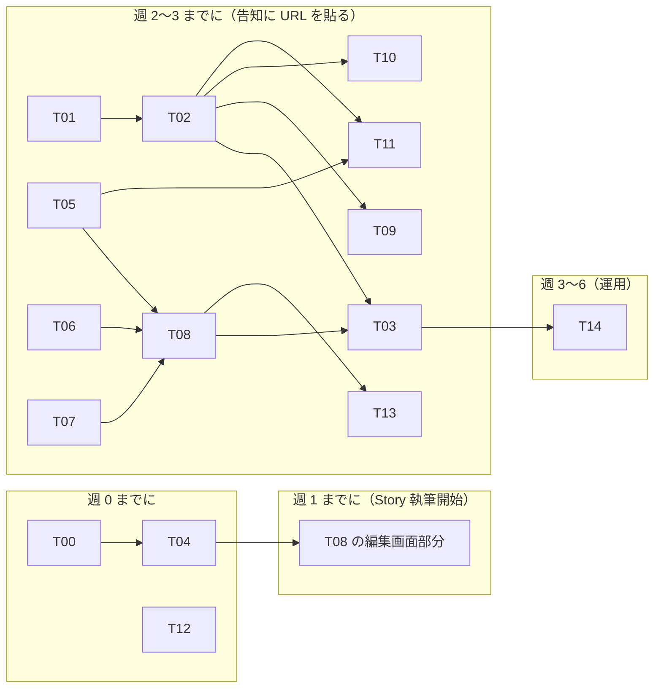

# チケット索引 — 「知る → 応援する」検証ベータ

> [`prd.md`](../prd.md) の施策（F1〜F9）と計測（§6）を、現状の実装との差分から分解したチケット群。
> **未合意（discussions）**。着手前に T00 で規範との差分を合意する。

---

## 1. 分析 — PRD が要求するもの vs 現状

### 1-1. 現状（実装済みの土台）

| 領域           | 現状                                                                                                    |
| -------------- | -------------------------------------------------------------------------------------------------------- |
| プロフィール   | `artist_profiles`（name / image / tagline / `story: text` / 活動情報）＋ genres・links（1:N）・公開フラグ |
| 公開制御       | 保存と公開の分離、`ensurePublishable`（ドメイン policy）、公開詳細ページ（#237）                          |
| 認証・登録     | Auth0 ＋ onboarding ＋ middleware セッションガード（#243）                                                |
| 計測           | **無い**。`analytics_events` テーブル・`track()` ラッパ・取り込みルートすべて未実装                       |
| 一覧           | モックデータ（PRD §5-3 により公開しない。DB 連携もベータでは行わない）                                    |

### 1-2. PRD 要求との差分（何が必要か）

PRD の提供物は 3 種に分かれる。**作るもの（コード）／手作業（運用）／決めるもの（合意）**。

| 種別   | 内容                                                                                                                       | チケット           |
| ------ | --------------------------------------------------------------------------------------------------------------------------- | ------------------ |
| 決める | PRD 本文の合意、計測基盤の L2 選択（自前 / PostHog）、規範ドキュメント反映（§10）                                           | T00                |
| 作る   | 計測基盤（テーブル・取り込み・`track()`・ページ配線）                                                                        | T01, T02, T03      |
| 作る   | 情報構造の拡張（Story 章構造・オファー・翻訳・聴きどころ）                                                                   | T04, T05, T06, T07 |
| 作る   | 詳細ページの §5-2 再構成と応援導線（アンケート・受信登録・招待）                                                             | T08, T09, T10, T11 |
| 手作業 | ベータ運用（聞き取り・割り付け・告知素材・週次の返し）                                                                       | T12, T13, T14      |

### 1-3. 作らないもの（PRD §5-3 の再掲 — チケットに存在しないことが正しい）

一覧の公開・並び替え・絞り込み／会員制・コミュニティ・チャット／決済・チケット販売／告知画像の自動生成・数字ダッシュボード／見た目の作り込み。
F6（告知素材）と F8（数字の返し）は**機能化しない**。手作業チケット（T13・T14）として持つ。

---

## 2. チケット一覧

| ID                                          | タイトル                                                     | 対応（PRD）  | 種別   | 依存          | 規模 |
| ------------------------------------------- | ------------------------------------------------------------ | ------------ | ------ | ------------- | ---- |
| [T00](./T00-agreement-and-doc-updates.md)   | 規範との差分合意・ドキュメント反映                           | §1, §10      | 決める | —             | S    |
| [T01](./T01-analytics-events-schema.md)     | `analytics_events` テーブルと migration                      | F5, §6-1     | 作る   | T00           | S    |
| [T02](./T02-events-ingest-and-tracker.md)   | 取り込みルート `POST /api/events` と `track()` ラッパ        | F5           | 作る   | T01           | M    |
| [T03](./T03-detail-page-instrumentation.md) | 詳細ページの計測配線（`from` / `position` 付き）             | F5, H2, H3   | 作る   | T02, T08      | M    |
| [T04](./T04-story-chapters.md)              | Story の章構造化（3 つの問い）                               | F1, H1       | 作る   | T00           | L    |
| [T05](./T05-offer.md)                       | オファー（日付・場所・チケット URL・一言・共演者）           | F2, H3, H6   | 作る   | T00           | L    |
| [T06](./T06-translation-paragraph.md)       | 翻訳段落（運営記入）                                         | F3, H4       | 作る   | T00           | S    |
| [T07](./T07-listening-point.md)             | 聴きどころ（動画 1 本＋一言）                                | F4, H3       | 作る   | T00           | S    |
| [T08](./T08-public-detail-page.md)          | 詳細ページの §5-2 再構成（7 区画・オファー状態・空区画非表示） | §5-2         | 作る   | T04〜T07      | L    |
| [T09](./T09-visitor-survey.md)              | 一問アンケート（ビートボクサー判定）                         | F5, H2       | 作る   | T02, T08      | S    |
| [T10](./T10-notify-subscribe.md)            | 「次の告知を受け取る」（メール受信登録）                     | F7, H5       | 作る   | T02, T08      | M    |
| [T11](./T11-invite-link.md)                 | 共演者からの招待リンク                                       | F9, H6       | 作る   | T02, T05      | M    |
| [T12](./T12-beta-ops-kit.md)                | ベータ運用キット（声かけ・聞き取り・割り付け）               | §7           | 手作業 | —             | M    |
| [T13](./T13-announce-assets.md)             | 告知素材（縦画像 3 枚 × 人数分）                             | F6, H1, H2   | 手作業 | T08           | M    |
| [T14](./T14-weekly-numbers-report.md)       | 週次の数字の返し（SQL → 定型文）                             | F8, H1, H6   | 手作業 | T03           | M    |

---

## 3. 実装順序（ベータ進行 §7-4 から逆算）

- **クリティカルパスは T04（Story 章構造化）**。週 1 の執筆開始までに、書ける器（章構造＋編集画面）が要る。
- 計測（T01〜T03）は「告知に URL を貼る」前（週 2〜3）までに揃えばよいが、`profile_view` の取りこぼしは検証データの欠落に直結するため、T08 公開と同時にはデプロイされていること。
- T12（運用キット）はコードに依存しない。並行して最初に進められる。

## 4. チケットの書式

各チケットは次の構成で書く: **背景（PRD の該当箇所）／スコープ（やること・やらないこと）／受け入れ条件／着手前に決めること**。
実装時は該当領域の設計ドキュメント（`docs/architecture/`）を先に読むこと（CLAUDE.md の規約）。
