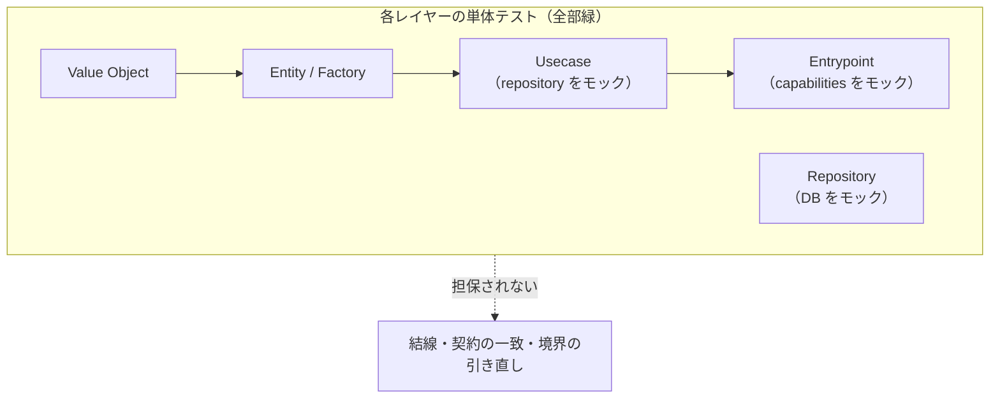

# 大規模リファクタをどこで担保するか

> **ステータス: 未合意（提案）**
> `discussions/` は規範ではない。合意した内容だけを [`architecture/testing/strategy.md`](../architecture/testing/strategy.md) へ昇格させる。
> 関連: [testing/strategy.md](../architecture/testing/strategy.md) / [testing/README.md](../architecture/testing/README.md) / [server/architecture.md](../architecture/server/architecture.md)

## 何を決めたいか

大きなリファクタリングを行ったとき、**変更後の実装が壊れていないことをどこで検知するか**。

きっかけになった問い:

> 現在は単体テストをレイヤーごとに書いている。単体テストで I/O の検証ができていれば、
> それぞれのレイヤーのテストが通ることで担保されていると保証されるか。
> 懸念は、単体テストはあくまでモックで担保されているものだという点。

この違和感は正しい。以下で分解する。

## 結論

**保証されない。**

各レイヤーの単体テストが全部緑になっても担保されるのは「各レイヤーが **自分の仮定の下で** 正しい」ことだけ。リファクタで壊れるものの多くは、その仮定と仮定の**あいだ**にある。

[strategy.md §5](../architecture/testing/strategy.md) は「モックの嘘」としてこの問題の一部を既に認識しているが、**大規模リファクタ特有の穴**（下の論点 3）は未言及。

---

## 現状



| レイヤー         | 現状のテスト                | モックしているもの              |
| ---------------- | --------------------------- | ------------------------------- |
| Value Object     | 純粋関数の単体              | なし                            |
| Entity / Factory | IO + spy                    | なし                            |
| Usecase          | capabilities をモック       | Repository / トランザクション   |
| Repository       | executor をモック           | 実 DB                           |
| Entrypoint (API) | Hono `app.request()` で実行 | **capabilities モジュール全体** |

---

## 論点

### 論点 1: 契約の嘘（モック ≠ 実装）— 既知・一部対処済み

`userRepository.findBySub` が実際に何を返すか（`null` か例外か、大文字小文字を無視するか、削除済みを含むか）は、モックには「書いた人が信じている契約」しか入っていない。実装と乖離しても単体テストでは構造的に検出できない。

**このリポジトリはこの穴をかなり塞げている。**

`apps/api-server/src/usecases/users/createUser/index.test.ts` は型でモックを釘付けにしている:

```ts
const createCaps = () =>
  ({
    users: {
      findBySub: vi.fn<IUserReader["findBySub"]>(async () => null),
      save: vi.fn<IUserWriter["save"]>(),
      // ...
    },
  }) satisfies RegistrationCapabilities;
```

これにより **シグネチャの嘘はコンパイルエラーになる**。残っているのは**セマンティクスの嘘**（型は同じだが振る舞いが違う）だけで、これは実 DB Integration でしか取れない。

> 一方 `apps/api-server/src/app/api/[[...route]]/users/post/index.test.ts` のモックは型で縛られていない（`vi.fn()` 素、`caps: unknown`）。
> usecase 層で塞いだ穴が entrypoint 層で開いている。

### 論点 2: 結線（wiring）— いま最も空いている

`apps/api-server/src/infrastructure/capabilities/index.ts` の `getCapabilityDeps` が唯一の配線点:

```ts
runWithRegistrationCapabilities: (work) =>
  runInTransaction(db, buildRegistrationCapabilities, work),
```

しかし entrypoint テストはこのモジュールを丸ごと `vi.mock` で差し替えている:

```ts
vi.mock(".../infrastructure/capabilities", () => ({
  getCapabilityDeps: () => ({
    runWithRegistrationCapabilities: (work) =>
      work({ users: mockUsers, artists: mockArtists }),
  }),
}));
```

**`runInTransaction` が消えている。** その結果、以下は **どの単体テストも通っていない**:

- `runInTransaction` が実際に usecase を包んでいるか
- `buildRegistrationCapabilities` が正しい executor を repository に渡しているか
- ロールバックが実際に効くか

`infrastructure/transaction/index.test.ts` は `runInTransaction` 単体を見ているだけで、「usecase がその中で走っている」ことは誰も見ていない。

つまり [code-review-checklist §10（トランザクション境界 🔴 ブロッキング）](../../.claude/rules/code-review-checklist.md) が、**テストの構造上そもそも検証不能**な状態にある。

### 論点 3: リファクタと同時に書き換わるテストは、そのリファクタを検証できない

**大規模リファクタでは、これが最大の穴。** 論点 1・2 とは別物。

`getContainer` 廃止 → capabilities 移行（#203）のような変更では、usecase のシグネチャが変わる → テストのモック構築も一緒に書き換わる。**新しい実装に合わせて書き直したテスト**が緑になっても、それは「新実装が新実装の想定通り動く」以上のことを言っていない。**旧の振る舞いが保存されたかは誰も見ていない。**

strategy.md §1 は「内部実装を自由にリファクタできる」と書いているが、その「内部」の定義は**レイヤー境界の内側まで**である。

> **境界そのものを引き直すリファクタは、単体テストの守備範囲の外にある。**

---

## 提案

原則は一つ:

> **リファクタで書き換わらないテストだけが、そのリファクタを担保できる。**

大規模リファクタで動かない観測点をどこに持つか、という**設計問題**として扱う。

### 提案 1: entrypoint テストを「本番と同じ結線」で回す（最優先・低コスト）

`getCapabilityDeps` 全体を `vi.mock` するのをやめ、差し替えるのは **`getDb` だけ**にする。`runInTransaction` / `buildXxxCapabilities` は実物を通す。

|                | 現状                          | 提案                                                                    |
| -------------- | ----------------------------- | ----------------------------------------------------------------------- |
| モック境界     | `infrastructure/capabilities` | `infrastructure/database`（`getDb`）                                    |
| 通る経路       | route → usecase               | route → capabilities builder → runInTransaction → repository → executor |
| 担保されるもの | HTTP 変換・usecase 呼び出し   | 上記 + 結線 + トランザクション境界                                      |

効果:

- **HTTP in → HTTP out** という、レイヤー分割から独立した観測点ができる。内部をどう再編しても書き換わらない（論点 3 への対処）
- トランザクション境界の検証がここに乗る（論点 2 への対処）
- entrypoint のモックも `satisfies` で型を釘付けにする（論点 1 の穴埋め）

### 提案 2: Repository Integration（Phase 2 / testcontainers）

[strategy.md §7-3](../architecture/testing/strategy.md) の通り。論点 1 の**セマンティクスの嘘**はここでしか取れない。

ここまで来れば `getDb` も実物になり、提案 1 の entrypoint テストがそのまま「結線 + 契約」両方の担保になる。

### 提案 3: 大規模リファクタ時の手順を規約にする

- **テストを書き換えずにリファクタする** → 緑を確認 → **その後で**テストを整理する
- テストが同時に変わった範囲は「担保外」として PR に明記する
- **型検査を第一の担保として扱う。** 現在の capabilities 設計は型がよく効いており、実際には単体テストより結線の誤りを多く捕まえている。リファクタでは `tsc` が主力・テストが補助という順序を意識する
- **境界を引き直す前に、引き直しても壊れない観測点（提案 1）を先に用意する**

### 提案 4: Mutation Testing（将来・優先度低）

「このテストは本当に振る舞いを縛っているのか」を測る唯一の手段。strategy.md §6 で数値カバレッジを捨てている以上、テストの質を測る軸が現在ゼロである。

ただし提案 1・2 の後で十分。

---

## 担保の役割分担（提案後の姿）

| 検出したいもの                 | 担保する場所                         | 現状                 |
| ------------------------------ | ------------------------------------ | -------------------- |
| 値・ドメインルールの正しさ     | VO / Entity / Policy の単体          | ✅ ある              |
| 業務フローの分岐               | Usecase の単体（モック）             | ✅ ある              |
| HTTP 変換・認証認可            | Entrypoint の単体                    | ✅ ある              |
| **結線・トランザクション境界** | **Entrypoint（`getDb` のみモック）** | ❌ 提案 1            |
| **モック契約と実装の一致**     | **Repository Integration（実 DB）**  | ❌ 提案 2（Phase 2） |
| **境界の引き直しによる退行**   | **書き換わらない観測点 + 手順**      | ❌ 提案 1 + 3        |
| テスト自体の質                 | Mutation Testing                     | ❌ 提案 4（将来）    |

---

## 次のアクション

1. この文書の提案 1・3 について合意を取る
2. 合意したら [`architecture/testing/strategy.md`](../architecture/testing/strategy.md) に「大規模リファクタ時の担保」節として昇格させる
3. 提案 1 を `users/post` の entrypoint テストで試し、パターンが機能するか確認する
4. 提案 2 は Phase 2 の既定路線として維持する
