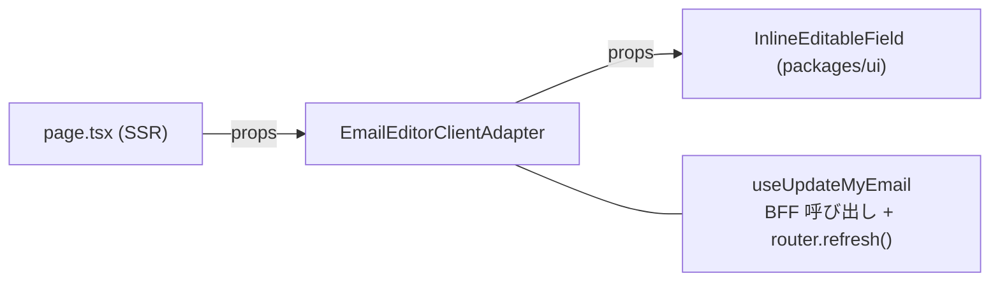

# 更新結果のユーザー通知（トースト）をどこに置くか

> **ステータス: 未合意（提案）**
> `discussions/` は規範ではない。合意した内容だけを `architecture/frontend/` へ昇格させる。
> 関連: [state-management.md](../architecture/frontend/state-management.md) / [ui/component-design.md](../architecture/frontend/ui/component-design.md) / [implementation.md](../architecture/frontend/implementation.md)

## 何を決めたいか

`apps/beatfolio` のアカウント設定画面で、更新の成否をトーストで伝えたい。
このとき **「通知する」という判断と文言をどのレイヤーが持つか** を決める。

きっかけは「通信 hook（`useUpdateMyEmail`）の中にトーストを書くのは気持ち悪い」という違和感。この違和感は正しく、下の「論点」で分解する。

## 現状



| レイヤー                               | 現在の責務                                                               |
| -------------------------------------- | ------------------------------------------------------------------------ |
| `page.tsx`                             | データ取得と props の配布                                                |
| `ClientAdapter`                        | hook と UI の接続                                                        |
| `hooks/useUpdateMyEmail`               | BFF への POST、`isLoading` / `error` の保持、成功時の `router.refresh()` |
| `InlineEditableField`（`packages/ui`） | 編集モードの開閉、`error` の inline 表示、`onSave` の `boolean` で確定   |

**成功時のフィードバックは現在まったく無い**（値が差し替わるだけ）。失敗時は欄下に inline 表示される。

## 論点

### 1. hook にトーストを書くと責務が混ざる

hook はアプリケーション層（通信・再取得トリガ）であり、トーストは**表現**。混ぜると hook のテストに UI 都合が入り、api-server 側のエラー追加のたびに hook が太る。

### 2. 結果は state ではなく戻り値で返す必要がある

現在 `error` は hook の state なので、Adapter 側で `await update()` の直後に読むと**クロージャが古い値を掴む**。どの案を採っても、`update` の戻り値に成否と理由を載せる形（`Promise<UpdateResult>`）は前提になる。

```ts
type UpdateResult = { ok: true } | { ok: false; message: string };
```

### 3. トーストのキューは「クライアント固有の共有状態」に当たる

layout に置いた `<Toaster />` へ、離れた Adapter からイベントを飛ばす構造になる。これは [state-management.md](../architecture/frontend/state-management.md) の「再検討の条件」に触れる。**UI 表示器への一方向の通知であって、真実の写しを持つわけではない**という整理で例外扱いにできるが、明文化しないと「グローバル状態を入れない」方針と矛盾して見える。

### 4. inline error とトーストの役割分担

`InlineEditableField` は既に `error` を欄下に出す。線引きを決めないと、同じ失敗が二重に出る。

---

## 案

### 案1: Adapter が結果を見て通知する（hook は通信だけ）

```tsx
// hooks/useUpdateMyEmail — toast を知らない
const update = async ({ email }): Promise<UpdateResult> => { ... };

// EmailEditorClientAdapter/index.tsx — 通知するのはここ
onSave={async (newValue) => {
  const result = await update({ email: newValue });
  if (result.ok) toast.success("メールアドレスを更新しました");
  else toast.error(result.message);
  return result.ok; // UI へは boolean に変換して渡す
}}
```

| 観点     | 内容                                                               |
| -------- | ------------------------------------------------------------------ |
| 責務     | hook = 通信 / Adapter = 通知の判断と文言 / `packages/ui` = 描画    |
| 利点     | 既存のレイヤー分けに素直。hook のテストは通信だけを見ればよい      |
| 欠点     | Adapter ごとに分岐と文言が並ぶ（現在 Email / AccountId の 2 箇所） |
| 影響範囲 | hook の戻り値型、Adapter、Toaster の設置                           |

### 案2: 通知を合成する薄い hook を app 層に置く（案1 の発展）

```tsx
const { update, isLoading } = useNotifiedMutation(useUpdateMyEmail().update, {
  success: "メールアドレスを更新しました",
});
```

| 観点     | 内容                                                                          |
| -------- | ----------------------------------------------------------------------------- |
| 責務     | hook = 通信 / 合成 hook = 通知ポリシー / Adapter = 文言の宣言                 |
| 利点     | 通知ポリシー（成功時に出す・失敗理由を出す・多重発火の抑制）が 1 箇所に集まる |
| 欠点     | 抽象が 1 段増える。Adapter が 1 つしかない段階では過剰                        |
| 影響範囲 | 案1 + 合成 hook（`apps/beatfolio` 側の共通 hooks）                            |

### 案3: `packages/ui` にフィードバック機構を持たせ、molecule が結果から通知する

`InlineEditableField` の `onSave` を `Promise<UpdateResult>` にし、UI 側の `ToastProvider` で保存 UI が自分で通知まで行う。

| 観点 | 内容                                                                                              |
| ---- | ------------------------------------------------------------------------------------------------- |
| 利点 | 「保存フィールドの作法」が UI に閉じ、全画面で一貫する                                            |
| 欠点 | **通知するかどうかの判断が UI に移る**。`packages/ui` の props in / callback out 原則から越境気味 |
| 判断 | 文言を props で渡せば語彙のハードコードは避けられるが、判断の所在が UI に寄る点が論点             |

### 案4: 更新完了をサーバー起点で伝える

`router.refresh()` 後、search param や cookie に結果を載せて `page.tsx` 側で通知する。

| 観点 | 内容                                                 |
| ---- | ---------------------------------------------------- |
| 利点 | クライアント状態がゼロ。SSR の再取得と整合する       |
| 欠点 | URL が汚れる。実装が重く体験も遅い。この規模では過剰 |

---

## 推奨

**案1 を土台にし、Adapter が 2 つある現状では案2 まで進める。**

理由は、hook を「通信」に閉じておけば、api-server 側のエラー追加（例: `EmailAlreadyTakenError` → 409）を**文言マッピングの差し替えだけ**で吸収でき、hook とそのテストが太らないため。

トースト機構そのものの置き場は、どの案でも次の分担にすると既存ドキュメントと整合する。

| 要素                       | 置き場                                       | 理由                                      |
| -------------------------- | -------------------------------------------- | ----------------------------------------- |
| `Toaster`（表示器）        | `packages/ui`（sonner を primitives として） | UI の描画責務                             |
| `<Toaster />` の設置       | `apps/beatfolio` の layout                   | `"use client"` 境界と同じくアプリ側の判断 |
| 発火（何をいつ通知するか） | Adapter または合成 hook                      | アプリケーションの都合                    |
| 文言                       | 発火側                                       | UI に語彙を持たせない                     |

### inline error とトーストの線引き（案）

| 失敗の種類                               | 表示方法       | 理由                             |
| ---------------------------------------- | -------------- | -------------------------------- |
| 入力値に紐づく失敗（422 形式・409 重複） | inline（欄下） | 直す対象が目の前の入力欄にある   |
| 回線・想定外の失敗（5xx / ネットワーク） | トースト       | 入力欄に紐づかない               |
| 成功                                     | トースト       | 画面上に成功を示す場所が他に無い |

---

## 決めるべきこと（未合意）

1. どの案を採るか（推奨は案1 →案2）
2. sonner を導入するか。導入する場合は `packages/ui` の primitives 層に置く（[primitives-discussion.md](./primitives-discussion.md) の現行方針に従い、生成コードは改変しない）
3. トーストのキューを「グローバル状態を持ち込まない」方針の例外として認めるか。認めるなら [state-management.md](../architecture/frontend/state-management.md) に一節を追記する
4. inline error とトーストの線引きを上表で確定するか

## 合意後の昇格先

| 決まった内容                     | 昇格先                                         |
| -------------------------------- | ---------------------------------------------- |
| 通知の責務分担と発火レイヤー     | `architecture/frontend/implementation.md`      |
| Toaster の配置と UI 側の責務境界 | `architecture/frontend/ui/component-design.md` |
| トーストキューの例外扱い         | `architecture/frontend/state-management.md`    |
