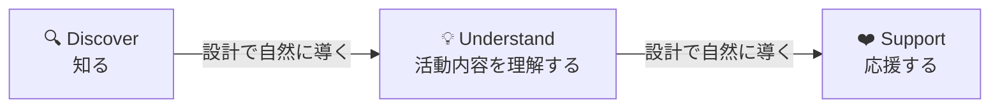
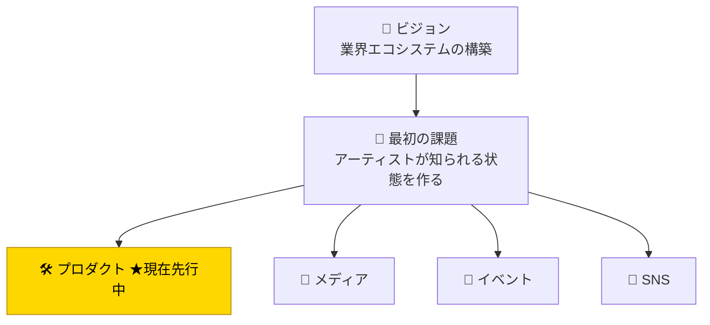
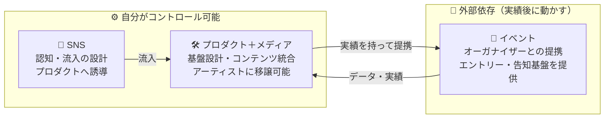
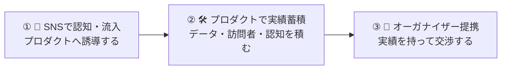
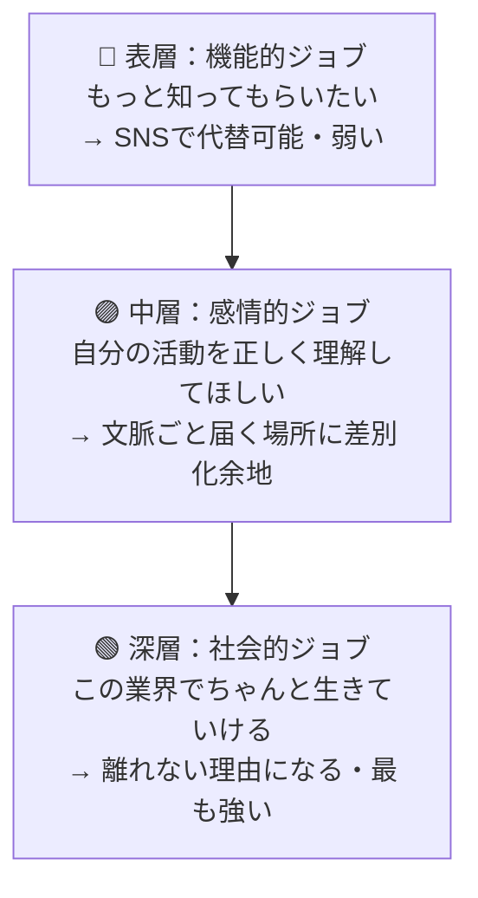
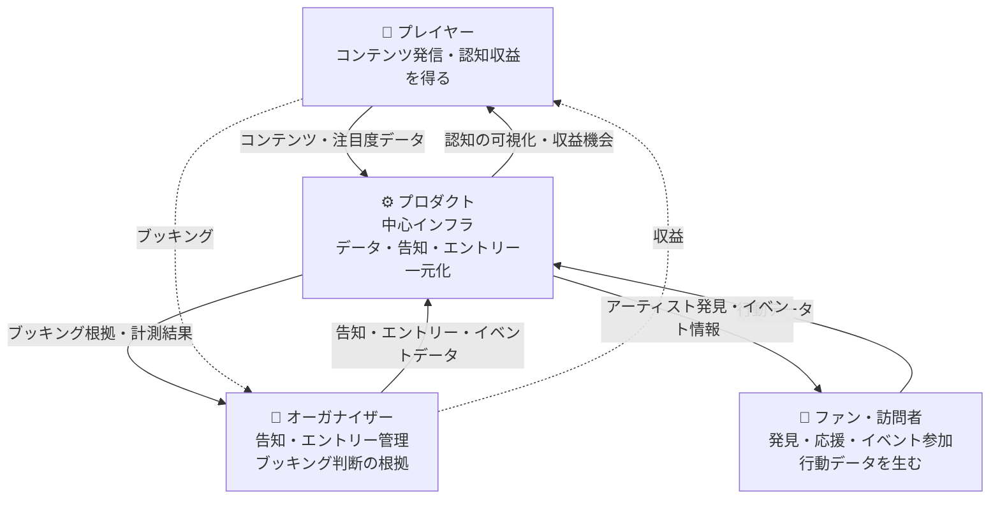
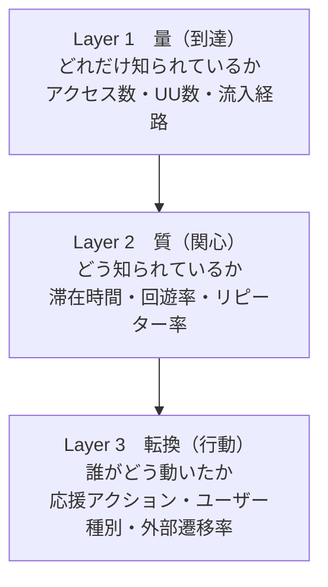
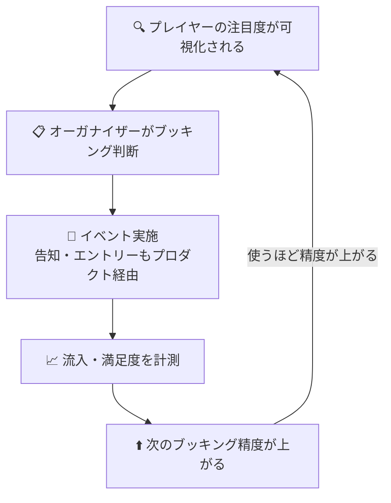
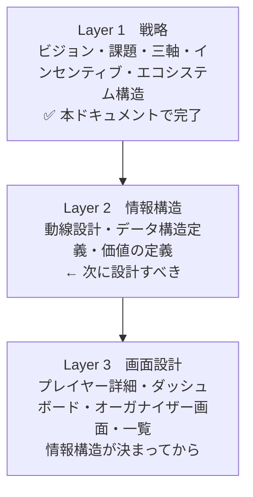

# BeatSinkCentral — 設計の中核

> すべての設計判断（動線・項目・機能・KPI）の最上位にある決定事項を集約する。
> 判断に迷ったときの最終参照先として機能させる。

---

## 🌟 ビジョン

> **業界エコシステムの構築。アーティストが持続的に活動できる環境を整備し、提供し続けること。**

このプロダクトは「特定の機能を提供するツール」ではない。
プレイヤー・オーガナイザー・ファンが**自分の利益のために使った結果、業界全体が持続可能になる構造**を設計する。

---

## 🎯 最初の課題

> **アーティストが「知られる」状態を作ること。**

知られていなければ、応援も収益もブッキングも始まらない。
業界エコシステムの最初の入口は**認知**にある。

> Understandの段階に**運営者の編集・文脈づけ**が入ることが、
> Discover → Supportのファネルが機能する条件になる。
> 自己申告プロフィールだけではUnderstandが成立せず、Supportに到達しない。

---

## 🧠 構造的な自己認識

| 認識          | 内容                                               |
| ------------- | -------------------------------------------------- |
| ⚠️ エゴの自覚 | 「作れるから作る」エンジニア起点を自認している     |
| ✅ 本来の順序 | 課題 → 最適な手段の選択 → 実装                     |
| ❌ 現状       | 手段（プロダクト）の選択が、検証前に固定されていた |

> ★ プロダクトは手段の一つに過ぎない。
> それでもプロダクトを先行させる根拠を常に明示できる状態を保つ。

---

## 🏗️ 三つの戦略軸

### 実行順序

> コントロール可能な軸から先に動かすのが戦略の鉄則。
> イベント軸は実績が生まれてから。

---

## 👤 プレイヤーのジョブ三層

| 層             | ジョブ                           | 差別化余地                 |
| -------------- | -------------------------------- | -------------------------- |
| 表層（機能的） | もっと知ってもらいたい           | 低い（SNSで代替可能）      |
| 中層（感情的） | 自分の活動を正しく理解してほしい | 高い                       |
| 深層（社会的） | この業界でちゃんと生きていける   | 最大（代替が極めて少ない） |

> 設計の力点は**中層〜深層**に置く。
> 表層だけを狙うとSNSとの機能比較に巻き込まれ、ビジョンと噛み合わない。

---

## 💡 インセンティブ設計

| フェーズ                        | プレイヤー                       | オーガナイザー           |
| ------------------------------- | -------------------------------- | ------------------------ |
| **Phase 1**（プロダクト内完結） | 発信コストほぼゼロ・認知の可視化 | ー                       |
| **Phase 2**（イベント連携後）   | ブッキング経由の第二収入源       | 次の施策判断の根拠データ |

> 「使ってください」とお願いするのではなく、
> **使うと自分の利益になるから使われる**設計が最も強い。

---

## 🔄 エコシステムの全体構造

| 参加者            | 使う理由                   | 渡すもの                 | 得るもの                       |
| ----------------- | -------------------------- | ------------------------ | ------------------------------ |
| 🎤 プレイヤー     | 認知・収益のため           | コンテンツ・注目度データ | 認知の可視化・収益機会         |
| 🎪 オーガナイザー | 告知・エントリー管理のため | イベントデータ           | ブッキング根拠・計測結果       |
| 👥 ファン         | アーティストを発見するため | 行動データ               | アーティスト発見・イベント情報 |

> Phase 1では**プレイヤー ↔ ファン**の辺を最初に成立させる。
> Phase 2以降で**オーガナイザー**の辺を統合する。

---

## 📊 計測設計

### 認知可視化の三層

### Discover / Understand / Support 対応指標

| 段階       | 問い               | 指標                                 |
| ---------- | ------------------ | ------------------------------------ |
| Discover   | 知られているか     | プロフィールアクセス数・一覧露出回数 |
| Understand | どう知られているか | 平均滞在時間・スクロール深度・完読率 |
| Support    | 応援に至ったか     | SNSリンククリック・外部遷移数        |

### 計測ループ

---

## 📐 情報設計の階層

### Layer 2で答える三つの問い

| 問い           | 内容                             | 未決の状態だと             |
| -------------- | -------------------------------- | -------------------------- |
| 動線設計       | 誰がどこから入りどこへ向かうか   | 何を作るかの判断基準がない |
| データ構造定義 | 動線上の行動を何として記録するか | Phase 2の価値が生まれない  |
| 価値の定義     | 誰のどんな判断を助けるか         | 誰にとっても中途半端になる |

---

## ⚠️ 未決事項（Howのフェーズで詰める）

- [ ] 最初のプレイヤー・オーガナイザー・ファンを誰にするか
- [ ] SNS戦略の具体的な設計
- [ ] プロダクトなしでもアーティストが知られる状態を作る最初の実験
- [ ] オーガナイザーがデータに価値を感じるかの検証
- [ ] プレイヤーが収益転換まで離脱せずに残るかの検証
- [ ] 動線設計（ファン・オーガナイザー・プレイヤーそれぞれ）
- [ ] 蓄積すべきデータ構造の定義

---

## 🗂️ ドキュメント構成

| ドキュメント                   | 役割                                | 状態      |
| ------------------------------ | ----------------------------------- | --------- |
| `design-core.md`（本書）       | Layer 1：戦略・ビジョン・構造       | ✅ 完了   |
| `phase0-flow-design.md`        | Layer 2：動線設計・プロフィール項目 | 🔄 要改訂 |
| `roadmap.md`                   | Layer 3：実装順序・タスク管理       | 📋 運用中 |
| `step1-implementation-plan.md` | Step 1詳細実装計画                  | 📋 運用中 |
| `ui-implementation-plan.md`    | UI実装方針                          | 📋 運用中 |

> `phase0-service-foundation.md` と `phase0-service-positioning.md` は
> 本書に統合済みのため参照不要。
