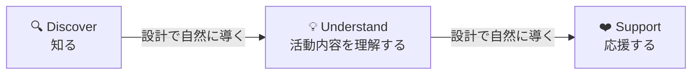
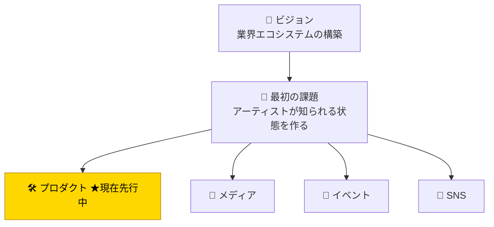
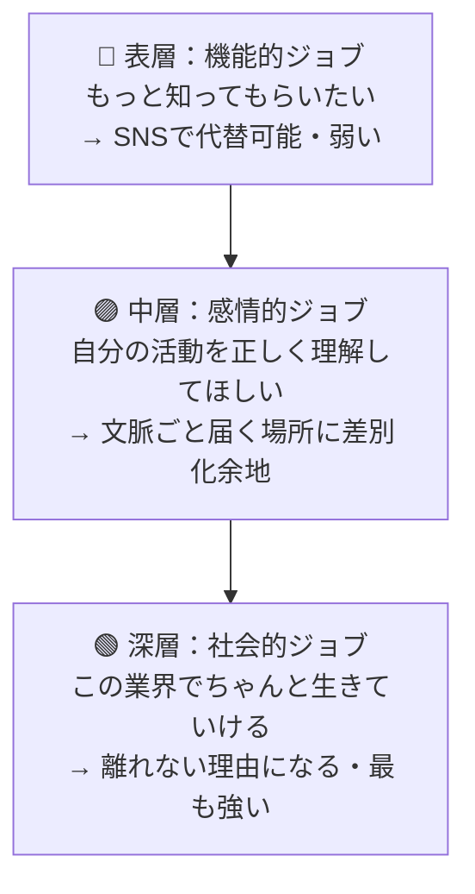
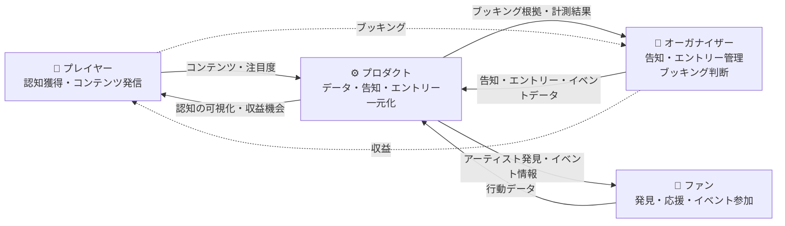

# 設計の中核 — Vision & Thesis

> このドキュメントは、Phase 0 / Phase 1 のすべての設計判断（動線・項目・機能・KPI）の
> **最上位にある決定事項**を集約する。
> 下位ドキュメント（`roadmap.md` / `phase0-*.md` / `step1-*.md`）は、本書の決定と矛盾しない
> 範囲で具体化される。判断に迷ったときの最終参照先として機能させる。

---

## 🌟 1. ビジョン

> **業界エコシステムの構築。アーティストが持続的に活動できる環境を整備し、提供し続けること。**

このプロダクトは「特定の機能を提供するツール」ではない。
プレイヤー・オーガナイザー・ファンが**自分の利益のために使った結果、業界全体が持続可能になる**
構造そのものの設計を目指す。

### ビジョンが意味すること

- 単一機能の最適化ではなく、業界の循環構造を作ることが成果
- 短期の機能比較で競合と争うのではなく、長期に積み上がる構造を作る
- KPI は単一指標ではなく、業界の健全性を表す複数指標の組み合わせになる

---

## 🎯 2. 最初の課題

ビジョンに対して、最初に解くべき課題は次の一点に絞られる。

> **アーティストが「知られる」状態を作ること。**

知られていなければ、応援も収益もエントリーもブッキングも始まらない。
業界エコシステムの最初の入口は **「認知」** にある。

---

## 🔁 3. 設計原則 — Discover → Understand → Support

「知られる」を訪問者側の体験で分解すると、次の三段階になる。

この三段階は **ユーザーの努力に依存させない**。
設計と編集の両輪で「気づいたら次の段階に進んでいる」状態を作る。

特に **Understand 段階に運営者の編集・文脈づけが入ること** が、
Discover → Support のファネルが機能する条件になる。
（自己申告プロフィールだけでは Understand が成立せず、Support に到達しない）

---

## 🧠 4. 構造的な自己認識

| 認識          | 内容                                               |
| ------------- | -------------------------------------------------- |
| ⚠️ エゴの自覚 | 「作れるから作る」エンジニア起点を自認している     |
| ✅ 本来の順序 | 課題 → 最適な手段の選択 → 実装                     |
| ❌ 現状       | 手段（プロダクト）の選択が、検証前に固定されていた |

> **★ 重要**: プロダクトは課題に対する手段の一つにすぎない。
> 本来「どの手段が最初に効くか」は検証されるべきで、
> プロダクト先行は構造的にバイアスがかかった選択であることを自覚する。

この自覚を持ったうえで、**それでもプロダクトを先行させる根拠**を明示できることが、
本書の存在意義になる。根拠が出せない判断は本書の決定とは見なさない。

---

## 👤 5. プレイヤーのジョブ三層

「アーティストが知られる」をプレイヤー側の動機構造で捉え直す。

| 層            | ジョブ                           | 競合状況              | 差別化余地 |
| ------------- | -------------------------------- | --------------------- | ---------- |
| 表層 (機能的) | もっと知ってもらいたい           | SNS / 既存配信        | 低い       |
| 中層 (感情的) | 自分の活動を正しく理解してほしい | 自前 SNS では限界あり | 高い       |
| 深層 (社会的) | この業界でちゃんと生きていける   | 代替が極めて少ない    | 最大       |

設計の力点は **中層〜深層** に置く。
表層だけを狙うと SNS との機能比較に巻き込まれ、本書のビジョンと噛み合わない。

---

## ⚙️ 6. 三者フライホイール

ビジョンの「業界エコシステム」を、三主体の循環として描く。

### 三者の関係整理

| 参加者            | 使う理由                             | プロダクトに渡すもの         | プロダクトから得るもの     |
| ----------------- | ------------------------------------ | ---------------------------- | -------------------------- |
| 🎤 プレイヤー     | 認知・収益のため                     | コンテンツ・注目度データ     | 認知の可視化・収益機会     |
| 🎪 オーガナイザー | 告知・エントリー管理・ブッキング判断 | イベント情報・参加者データ   | 集客・ブッキング根拠データ |
| 👥 ファン         | アーティスト発見・体験               | 行動データ（閲覧・フォロー） | 発見の体験・イベント情報   |

このループは**どこか一辺が止まると全体が回らない**。
ゆえに Phase 1 では負荷の少ない **プレイヤー ↔ ファン** の辺を最初に成立させ、
Phase 2 以降で **オーガナイザー** の辺を統合する順序を取る。

---

## 📈 7. フェーズ別インセンティブ

| フェーズ                        | プレイヤー                       | オーガナイザー           |
| ------------------------------- | -------------------------------- | ------------------------ |
| **Phase 1**（プロダクト内完結） | 発信コストほぼゼロ・認知の可視化 | （関与なし）             |
| **Phase 2**（イベント連携後）   | ブッキング経由の第二収入源       | 次の施策判断の根拠データ |

Phase 1 では「使うとコストがかかる」状態を避け、最低限のインセンティブで参加してもらう。
Phase 2 で初めて「収益が動く」段階に到達する。

---

## 📊 8. 計測設計

ビジョン → 課題 → 設計原則 を計測可能な指標に落とす。

### プレイヤー向け指標（Discover / Understand / Support 対応）

| 段階       | 問い               | 指標                                                                 |
| ---------- | ------------------ | -------------------------------------------------------------------- |
| Discover   | 知られているか     | プロフィールへのアクセス数 / 一覧での露出回数                        |
| Understand | どう知られているか | 平均滞在時間 / スクロール深度 / プロフィール完読率                   |
| Support    | 応援に至ったか     | SNS リンクのクリック / 外部遷移数 / Phase 2 以降はブッキング・参加数 |

### オーガナイザー向け指標（Phase 2）

| 問い               | 指標                            |
| ------------------ | ------------------------------- |
| 集客に効いたか     | イベント告知 → エントリー転換率 |
| ブッキング判断の質 | 過去ブッキング → 集客実績の相関 |

### エコシステム健全性指標

| 問い               | 指標                                                      |
| ------------------ | --------------------------------------------------------- |
| 循環が回っているか | プレイヤー × ファン × オーガナイザー の月次アクティブ比率 |
| 持続性が出ているか | 継続活動プレイヤー率 / 年次イベント数                     |

---

## 🔗 9. 本書から派生する判断

下位の設計ドキュメントは、本書の決定をもとに次のように具体化される。

| 下位ドキュメント                | 本書からの引き継ぎ                                                                              |
| ------------------------------- | ----------------------------------------------------------------------------------------------- |
| `roadmap.md`                    | Phase 1 のスコープを「プレイヤー ↔ ファン辺」に限定。Phase 2 でオーガナイザー辺を統合          |
| `phase0-service-foundation.md`  | 領域 = ビートボックス業界 / 編集視点 = §3 と §5 から逆算 / 三者利得 = §6 の関係表をベースに更新 |
| `phase0-service-positioning.md` | 編集メディア型に寄せる根拠は §3 Understand 段階の編集介入要件                                   |
| `phase0-flow-design.md`         | 動線を Discover → Understand → Support の三段階で再設計し、Understand に編集枠を入れる          |

---

## 関連ドキュメント

- [roadmap.md](./roadmap.md) — 本書を中核として参照する Phase 1 ロードマップ
- [phase0-service-foundation.md](./phase0-service-foundation.md) — 根幹設計のフレーム
- [phase0-service-positioning.md](./phase0-service-positioning.md) — ポジショニングと運営戦略
- [phase0-flow-design.md](./phase0-flow-design.md) — 動線設計
