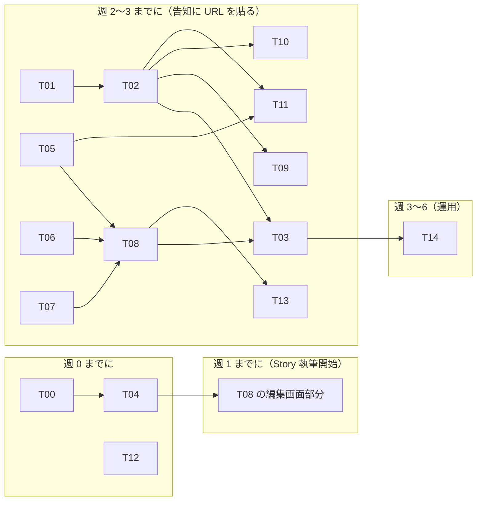

# 実行計画 — 「知る → 応援する」検証ベータ

> [`prd.md`](../../discussions/prd/know-to-support-verification/prd.md) のベータ（5〜8 人 × 6〜8 週）を実装・運用するための実行計画。
> **時限ドキュメント**（`plans/` の規約どおり、ベータ終了後は参照しない）。
> 作業の状態・各チケットの詳細（受け入れ条件・PR 分割）の正本は **GitHub Issues**。本書は全体像と規約だけを持つ。

- 統合 Issue: [#270](https://github.com/hirayamahiroto/beatSinkCentral/issues/270)（進捗はここを見る）
- マイルストーン: `know-to-support-beta`

---

## 1. 管理の分担（どこに何があるか）

| 情報                                                            | 正本                                                                                              |
| --------------------------------------------------------------- | ------------------------------------------------------------------------------------------------- |
| 検証の定義（仮説・指標・判断基準）                              | [`prd.md`](../../discussions/prd/know-to-support-verification/prd.md)（discussions・未合意）      |
| コンセプト・二周目以降の予約論点                                | [`concept-and-loops.md`](../../discussions/prd/know-to-support-verification/concept-and-loops.md) |
| 実行計画の全体像・規約                                          | 本書                                                                                              |
| 各チケットの詳細（背景・スコープ・受け入れ条件・PR 分割）と状態 | **各 sub-issue**（#255〜#269）                                                                    |
| 実装の判断根拠                                                  | `docs/product/` と `docs/architecture/` のみ（CLAUDE.md の規約）                                  |

---

## 2. チケット一覧

| Issue                                                                | ID  | タイトル                                              | 種別   | 依存     | 規模 |
| -------------------------------------------------------------------- | --- | ----------------------------------------------------- | ------ | -------- | ---- |
| [#255](https://github.com/hirayamahiroto/beatSinkCentral/issues/255) | T00 | 規範との差分合意・ドキュメント反映                    | 決める | —        | S    |
| [#256](https://github.com/hirayamahiroto/beatSinkCentral/issues/256) | T01 | `analytics_events` テーブルと migration               | 作る   | T00      | S    |
| [#257](https://github.com/hirayamahiroto/beatSinkCentral/issues/257) | T02 | 取り込みルート `POST /api/events` と `track()` ラッパ | 作る   | T01      | M    |
| [#258](https://github.com/hirayamahiroto/beatSinkCentral/issues/258) | T03 | 詳細ページの計測配線                                  | 作る   | T02, T08 | M    |
| [#259](https://github.com/hirayamahiroto/beatSinkCentral/issues/259) | T04 | Story の章構造化 ★クリティカルパス                    | 作る   | T00      | L    |
| [#260](https://github.com/hirayamahiroto/beatSinkCentral/issues/260) | T05 | オファー                                              | 作る   | T00      | L    |
| [#261](https://github.com/hirayamahiroto/beatSinkCentral/issues/261) | T06 | 翻訳段落                                              | 作る   | T00      | S    |
| [#262](https://github.com/hirayamahiroto/beatSinkCentral/issues/262) | T07 | 聴きどころ                                            | 作る   | T00      | S    |
| [#263](https://github.com/hirayamahiroto/beatSinkCentral/issues/263) | T08 | 詳細ページの §5-2 再構成                              | 作る   | T04〜T07 | L    |
| [#264](https://github.com/hirayamahiroto/beatSinkCentral/issues/264) | T09 | 一問アンケート                                        | 作る   | T02, T08 | S    |
| [#265](https://github.com/hirayamahiroto/beatSinkCentral/issues/265) | T10 | 「次の告知を受け取る」                                | 作る   | T02, T08 | M    |
| [#266](https://github.com/hirayamahiroto/beatSinkCentral/issues/266) | T11 | 共演者からの招待リンク                                | 作る   | T02, T05 | M    |
| [#267](https://github.com/hirayamahiroto/beatSinkCentral/issues/267) | T12 | ベータ運用キット                                      | 手作業 | —        | M    |
| [#268](https://github.com/hirayamahiroto/beatSinkCentral/issues/268) | T13 | 告知素材                                              | 手作業 | T08      | M    |
| [#269](https://github.com/hirayamahiroto/beatSinkCentral/issues/269) | T14 | 週次の数字の返し                                      | 手作業 | T03      | M    |

### 依存グラフ（ベータ週割りからの逆算）



---

## 3. 粒度規約（3 層モデル）

| 層            | 単位                                              | 粒度の定義                                                                                                  |
| ------------- | ------------------------------------------------- | ----------------------------------------------------------------------------------------------------------- |
| **Issue**     | 検証が必要とする**約束 1 つ**（縦切り）           | ベータに対する約束が 1 文で言える（「Story を問いで書けて公開できる」）                                     |
| **PR**        | **1 画面（区画）＋関連 API 一式**（縦切りが既定） | マージするとその挙動が end-to-end で動く。1 セッションで完結し、gate 全緑でマージでき、壊れた状態を残さない |
| **checklist** | 実装手順                                          | PR 内の作業ステップ。Issue にはしない                                                                       |

迷ったときの判定 4 つ:

1. 受け入れ条件が観察可能か（gate 全緑なら diff を読まずにマージできるか）
2. 1 PR ＝ 1 セッションで完結するか。しないなら割る
3. マージ後に中途半端を残さないか（縦の途中で切っても、未配線なだけでビルド・テストは緑。動かない UI は出さない）
4. 依存が一方向か（Issue 間は上のグラフ、PR 間はブランチの積み順）

**Issue は縦（レイヤー横切り禁止）。PR も縦（画面＋API 込み）が既定で、1 セッションに収まらないときだけレイヤー境界で分割する。**
分解・設計書の書式は `.claude/skills/task-breakdown/SKILL.md` のタスク設計書フォーマットに従う。

### L チケットの PR 分割（縦 1 本に収まらない場合の事前分割）

| チケット   | PR 分割                                                                                                                                     |
| ---------- | ------------------------------------------------------------------------------------------------------------------------------------------- |
| T04 (#259) | ① `story_questions` マスタ＋`story_chapters` スキーマ＋ドメイン＋既存 story 移行 → ② API・usecase＋BFF → ③ 編集画面の配線（Issue を閉じる） |
| T05 (#260) | ① スキーマ＋ドメイン（有効判定 policy 含む） → ② API＋BFF → ③ 編集フォーム                                                                  |
| T08 (#263) | ① 区画再構成＋BFF read → ② オファー状態切替＋未ログイン確認                                                                                 |

S/M チケットは 1 Issue ＝ 1 PR。

---

## 4. チケット実装の標準手順

設計は UI から逆算し、実装は DB から積み上げる。表現は 3 つ、写像の置き場は 2 つ:

```
DB 表現 ⇄［repository が写像］⇄ Entity（ドメイン表現） ⇄［BFF が整形］⇄ UI 契約（props）
```

1. **契約確認** — モック（`AudienceArtistProfile` の props）と PRD 該当節で、このチケットが満たす契約を凍結する
2. **DB スキーマ＋migration** — 正規化・マスタ参照は DB 側の抽象（`docs/architecture/server/database/design.md`）
3. **ドメイン・usecase・API** — `api-server-feature` skill に従う
4. **BFF** — 整形・解決（日付→表示形、code→label、有効判定→null）。UI 都合の形はここで作る
5. **UI 配線＋計測** — `frontend-feature` skill に従う。計測は UI 層のみ

- ブランチは sub-issue 単位（L は PR 単位）。PR 本文は中間 PR なら `Refs #N`、チケットを閉じる最終 PR だけ `Closes #N`
- 作業レールの詳細は `.claude/skills/beta-ticket/SKILL.md`（Claude Code 用ハーネス）

---

## 5. 着手順序（現時点）

1. **T00（#255）** — 4 決定（計測 L2／前室／オファー無し期間の主 CTA／第 3 問のコンセプト化）＋ concept-and-loops §6 の PRD 反映。ユーザーの判断が必要な唯一のチケット
2. T04（#259・クリティカルパス）と T01（#256）を並行着手。T12（#267）はコード非依存でいつでも
3. 以後は依存グラフ順
